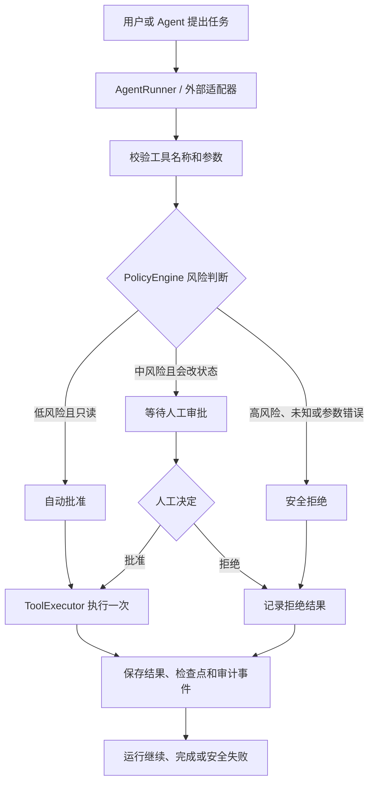

# AgentGate 本地 AI Agent 控制平面

AgentGate 是一个面向本机运行的 AI Agent 操作治理平台。它把 Agent 的“想做什么”与系统的“允许做什么、是否需要人工批准、执行后发生了什么”分开管理。

> 当前版本：Phase 1，本地控制流与只读监控 MVP
>
> 仓库默认模型：`mock` 确定性提供方；本机可在 `.env` 中切换为 Ark 等真实模型
>
> 当前部署方式：Windows + Docker Compose + 本机浏览器


这张截图展示本地控制台的产品界面，不代表生产部署或真实基础设施操作已经启用。

## 目录

- [一、项目解决什么问题](#一项目解决什么问题)
- [二、项目不负责什么](#二项目不负责什么)
- [三、核心工作流程](#三核心工作流程)
- [四、当前能力](#四当前能力)
- [五、环境要求](#五环境要求)
- [六、启动本地项目](#六启动本地项目)
- [七、首次初始化和登录](#七首次初始化和登录)
- [八、完成第一次功能验收](#八完成第一次功能验收)
- [九、连接真实的 OpenAI-compatible 模型](#九连接真实的-openai-compatible-模型)
- [十、接入其他 Agent](#十接入其他-agent)
- [十一、原生 Worker](#十一原生-worker)
- [十二、测试与验收](#十二测试与验收)
- [十三、常见问题](#十三常见问题)
- [十四、项目目录说明](#十四项目目录说明)
- [十五、安全要求](#十五安全要求)
- [十六、后续路线](#十六后续路线)

## 一、项目解决什么问题

普通的 Tool-calling Agent 会在同一个循环里同时完成以下事情：

1. 理解用户目标。
2. 选择工具。
3. 生成工具参数。
4. 执行可能改变系统状态的操作。

如果模型生成了错误参数、调用了未登记工具，或者把“查询”误判成“修改”，就可能产生不可预期的副作用。AgentGate 在 Agent 与工具执行之间增加一个可持久化的控制边界：

- 所有工具必须先登记，并声明风险级别和是否只读。
- 工具参数必须通过模型校验。
- 低风险只读操作可以自动执行。
- 会改变状态的中风险操作暂停，等待人工批准或拒绝。
- 高风险操作和未知工具默认拒绝。
- 运行状态、审批决定、工具结果和审计事件保存到 PostgreSQL。
- 运行中断后，可以根据检查点和持久化队列继续处理。
- 可以通过原生 Worker 只读检查本机 HTTP 地址和 Windows 服务，并按失败/恢复阈值生成事件。
- 原生 Worker 支持持续轮询、心跳保活和 journal 恢复，也可以配置为 Windows 当前用户登录时自动启动。
- 审计接口和界面会递归脱敏敏感字段。

因此，AgentGate 更接近“AI Agent 的安全控制平面、审批队列和审计台”，而不是一个新的大模型聊天窗口。

## 二、项目不负责什么

为了避免误用，当前版本明确不包含以下能力：

- 不提供通用聊天、搜索、RAG、情报收集或报告生成。
- 不会自动发现并监控电脑上所有 Agent；Agent 必须通过 AgentGate 的界面或 API 接入。
- 不会因为启动了 Worker 就自动扫描进程、窗口、端口或电脑上的其他软件；只有在“监控”页面登记的目标才会被检查。
- 不会在当前版本中真正重启 Windows 服务；监控只读取服务状态。
- 不允许任意执行 Shell、PowerShell 或其他命令。
- 不提供 Windows 内核驱动，也不会拦截绕过 AgentGate 的进程。
- 文件动作只支持受管工作区内的检查、隔离和恢复；不允许任意越界读写。
- 文件隔离是可恢复的移动，不是永久删除；恢复遇到目标冲突时会停止并要求人工处理。
- 不会真正轮换 API 密钥或其他凭据。
- `mock` 提供方不是具备真实推理能力的生产模型。
- 外部 Agent 的 `/api/v1/actions` 对文件动作会进入统一策略、审批和 Native Worker 队列；通用业务工具仍可只做策略预检。

当前示例中的 `payments-api` 和 `orders-api` 是数据库中的服务状态记录。调用 `restart_service` 只会把示例服务状态改为 `healthy` 并增加 `restart_count`，不会操作操作系统中的同名服务。

## 三、核心工作流程



系统中的关键边界如下：

| 边界 | 作用 |
| --- | --- |
| `ToolRegistry` | 维护允许使用的工具、参数模型和处理器 |
| `PolicyEngine` | 根据风险等级和只读属性做 fail-closed 决策 |
| `AgentRunner` | 管理模型对话、工具提议、检查点和恢复 |
| `ToolExecutor` | 以幂等键领取和执行工具，防止重复副作用 |
| PostgreSQL | 保存运行、动作、队列、租约、审批和审计证据 |
| `scheduler` | 回收过期租约、推动持久化任务 |
| `control-worker` | 处理持久化控制任务 |
| 原生 Worker | 支持 `platform.self_check`、本机 HTTP 和 Windows 服务只读探针 |

详细状态机和事务边界见 [架构说明](docs/architecture.md)。

## 四、当前能力

### 4.1 Web 控制台

登录后可以看到八个主要页面：

| 页面 | 用途 |
| --- | --- |
| `运行` | 提交 Agent 请求，查看任务、工具调用和审批状态 |
| `动作` | 按来源、状态和风险筛选已提交动作，显示相对路径和脱敏结果 |
| `审批` | 查看待审批队列，Worker 在线时批准执行或拒绝 |
| `文件治理` | 选择检查、隔离或恢复，提交受控文件动作 |
| `工作区` | 登记允许 Worker 操作的本机目录，查看保护规则和隔离记录 |
| `监控` | 登记本机 HTTP 地址或 Windows 服务，查看周期探测和故障状态 |
| `审计` | 按运行 ID、执行者或事件类型筛选审计事件，并导出 JSON |
| `系统` | 查看运行状态、策略、连接信息和系统级操作入口 |

界面默认使用中文；工具名、状态值和事件类型会同时保留必要的英文代码，便于与 API、日志和测试对应。

### 4.2 当前登记的工具

| 工具 | 风险 | 是否只读 | 当前决定 | 当前行为 |
| --- | --- | --- | --- | --- |
| `get_service_health` | 低 | 是 | 自动批准 | 读取示例服务健康状态和重启次数 |
| `search_logs` | 低 | 是 | 自动批准 | 读取示例诊断日志 |
| `restart_service` | 中 | 否 | 需要审批 | 修改数据库中的示例服务状态 |
| `rotate_api_key` | 高 | 否 | 拒绝 | 不会调用密钥处理器 |
| `platform.self_check` | 低 | 是 | 自动批准 | 原生 Worker 协议自检，不执行 Shell 或文件操作 |

### 4.3 受管文件动作

文件动作是本项目目前最完整的真实闭环：外部 Agent 只能提交相对路径，策略先拒绝 `.env` 等保护规则；普通文件必须经过管理员批准，再由 Windows Native Worker 在受管工作区内隔离，最后可以恢复。每一步都保存动作状态、文件 SHA-256 摘要、审批和审计游标。

| 动作 | 默认决定 | 实际效果 |
| --- | --- | --- |
| `file.inspect.v1` | 自动批准 | 只读返回文件存在性、大小和摘要，不返回内容 |
| `file.quarantine.v1` 访问 `.env`、`.git/**` 等 | 直接拒绝 | 不创建任务，不移动文件 |
| `file.quarantine.v1` 访问普通文件 | 需要审批 | 批准后在同一卷的隔离区内移动，并保留摘要 |
| `file.restore.v1` | 需要审批 | 批准后恢复原相对路径；目标已有文件时不覆盖 |

这条边界只对“经过 AgentGate API 的动作”生效。没有接入 AgentGate 的程序，或者直接绕过网关修改文件，当前版本无法拦截。

### 4.4 本机只读监控

进入“监控”页面后，可以添加两种目标：

| 类型 | 填写内容 | 检查行为 |
| --- | --- | --- |
| HTTP 地址 | 默认 `http://127.0.0.1:8000/health`；自定义端口按当前 API 配置填写 | 发送受限 HTTP 请求，只记录状态码和耗时，不保存响应正文 |
| Windows 服务 | `AgentGateWorker` | 固定执行 `sc.exe query AgentGateWorker`，只读取服务状态 |

安全限制：地址只能使用 `localhost`、`127.0.0.1` 或 `::1`；服务名只能使用字母、数字、点、下划线和短横线。间隔为 5 秒至 24 小时，超时为 1 至 30 秒。系统不会执行任意 Shell/PowerShell，也不会自动重启服务。

失败达到“失败阈值”后，目标显示“故障”并只创建一个活动事件；恢复达到“恢复阈值”后自动关闭事件。探针自身无法可靠执行时显示“未知”，不会把目标误报为故障。

### 4.5 运行状态

一次运行可能经过以下状态：

```text
queued
  -> running
  -> waiting_approval
  -> running
  -> completed
```

出现超时或安全失败时可能进入 `failed`。某个工具动作还会单独记录 `proposed`、`pending_approval`、`approved`、`denied`、`running`、`succeeded` 等状态。

## 五、环境要求

本地运行需要：

- Windows 10/11。
- Docker Desktop，并确保 Docker Compose 可用。
- Python 3.11 或更高版本；运行 API 测试时使用。
- Node.js 24 或更高版本；安装 Web 依赖和运行前端测试时使用。
- PowerShell。

检查命令：

```powershell
docker --version
docker compose version
py --version
node --version
npm.cmd --version
```

项目默认只绑定本机回环地址：

| 服务 | 默认地址 | 说明 |
| --- | --- | --- |
| Web | `http://127.0.0.1:5173` | 浏览器访问的控制台 |
| API | `http://127.0.0.1:8000` | 后端接口和健康检查 |
| PostgreSQL | 不发布宿主机端口 | 只在 Compose 网络内使用 |

当前运行实例如果使用了自定义端口，通常访问：

```text
http://127.0.0.1:15173
```

## 六、启动本地项目

### 6.1 推荐启动方式：一键准备和启动

在项目根目录执行：

```powershell
Set-Location 'D:\LLM Files\files\agentgate-control-plane'

powershell.exe -NoProfile -ExecutionPolicy Bypass -File .\scripts\setup-local.ps1
```

该脚本会：

1. 创建或复用 `apps/worker/.venv`。
2. 安装原生 Worker 依赖并检查 `win32crypt`。
3. 安装 Web 依赖。
4. 启动 PostgreSQL。
5. 执行数据库迁移。
6. 按 `.env` 中的提供方启动 API、scheduler、control-worker 和 Web；未配置时使用 `mock`。
7. API 健康检查通过后打开本地控制台。

只有启用密码认证时，首次初始化才需要读取 bootstrap token。脚本只打印文件路径，不会把 token 内容打印到终端：

```powershell
Get-Content .\data\bootstrap-token
```

当前默认免密模式不需要执行上面的读取步骤；启用 `AGENTGATE_AUTH_ENABLED=true` 后才需要使用它完成管理员初始化。

不要把这个 token、管理员密码或模型 API key 发送到聊天、截图、日志或 Git 仓库。

### 6.2 使用自定义端口

如果默认端口被其他程序占用，可以在启动前设置端口：

```powershell
Set-Location 'D:\LLM Files\files\agentgate-control-plane'

$env:AGENTGATE_API_PORT = '18230'
$env:AGENTGATE_WEB_PORT = '15173'

powershell.exe -NoProfile -ExecutionPolicy Bypass -File .\scripts\start-local.ps1 -Provider mock
```

然后打开：

```text
http://127.0.0.1:15173
```

端口必须是本机回环地址。当前脚本不支持把 API 或原生 Worker 指向远程服务器。

### 6.3 查看服务状态

```powershell
Set-Location 'D:\LLM Files\files\agentgate-control-plane'
docker compose ps
Invoke-RestMethod http://127.0.0.1:18230/health
```

如果使用默认端口，把 `18230` 换成 `8000`。健康检查返回 `status: ok` 才表示 API 已经启动。

### 6.4 停止项目

```powershell
Set-Location 'D:\LLM Files\files\agentgate-control-plane'
powershell.exe -NoProfile -ExecutionPolicy Bypass -File .\scripts\stop-local.ps1
```

停止脚本不会删除 PostgreSQL 数据卷，也不会删除 `.env` 或 `data/`。因此下次启动通常可以保留运行记录和管理员账号。

### 6.5 仅执行数据库迁移

```powershell
Set-Location 'D:\LLM Files\files\agentgate-control-plane'
powershell.exe -NoProfile -ExecutionPolicy Bypass -File .\scripts\migrate-local.ps1
```

### 6.6 一键本地准备（可选）

如果你希望快速准备一个受管工作区和真实文件动作的本地环境，在项目根目录执行：

```powershell
Set-Location 'D:\LLM Files\files\agentgate-control-plane'
powershell.exe -NoProfile -ExecutionPolicy Bypass -File .\scripts\demo.ps1
```

脚本会在 `%LOCALAPPDATA%\AgentGate\demo-workspace` 下准备本地文件，临时使用当前命令的端口覆盖启动配置，确认 API 和 Native Worker 在线，登记或复用这个工作区，然后打开 `/files`。它不会覆盖 `.env`，不会打印 Worker 引导令牌、Bearer token、管理员密码或模型 API key。

如果端口被占用，可以显式指定：

```powershell
powershell.exe -NoProfile -ExecutionPolicy Bypass -File .\scripts\demo.ps1 -ApiPort 18230 -WebPort 15173
```

`-ResetDemoData` 是兼容现有脚本调用的参数，只会删除文件治理工作区中脚本生成的 `demo.txt` 和 `demo-secret.txt`，不会删除数据库、审计记录或其他目录；`-NoBrowser` 适合自动化验收。

迁移由 Alembic 执行，生产代码不会用 `create_all()` 偷偷创建或覆盖数据库结构。

## 七、首次初始化和登录

### 7.0 本机免密模式（当前默认）

为了方便单人本机使用，Compose 默认使用 `AGENTGATE_ENV=development` 和 `AGENTGATE_AUTH_ENABLED=false`。在这个模式下：

- 打开 Web 地址会直接进入控制台，不需要管理员密码。
- 运行、审批、审计和监控等 Web 管理功能可以直接使用。
- 外部 Agent 的 Bearer client token、原生 Worker 的 enrollment token 和 Worker token 仍然需要，不会因为取消 Web 密码而取消。
- 免密模式只允许在 `AGENTGATE_ENV=development` 下运行；API 和 Web 仍只发布到 `127.0.0.1`，不要用于远程访问或生产环境。

以后需要恢复密码登录时，在项目根目录执行：

```powershell
$env:AGENTGATE_AUTH_ENABLED = 'true'
docker compose up -d --build --force-recreate api web
```

如果要持久启用密码登录，也把项目根目录 `.env` 中的 `AGENTGATE_AUTH_ENABLED` 改为 `true`。恢复免密时改回 `false`，再执行同一条 Compose 命令。当前实现保留了完整的初始化、登录、会话和 CSRF 流程。

### 7.1 第一次使用

只有在 `AGENTGATE_AUTH_ENABLED=true` 时才需要以下初始化步骤：

1. 打开 Web 地址。
2. 页面显示“初始化管理员密码”时，读取本机 `data/bootstrap-token`。
3. 把 token 填入“引导令牌”。
4. 设置管理员密码，长度至少 6 位。
5. 点击“完成初始化”。
6. 初始化成功后会自动建立会话。

bootstrap token 是一次性、短时有效的初始化凭据。初始化完成后，服务会删除 token 文件；之后登录只需要管理员密码。

### 7.2 已经初始化过

如果页面显示“登录”，只填写之前设置的管理员密码，不需要再填写引导令牌。

当前版本没有用户名字段，也没有公开的密码重置页面。不要因为登录失败就删除数据库；先确认访问的是同一个端口、同一个浏览器地址和同一个本地数据目录。

### 7.3 认证方式

- `AGENTGATE_AUTH_ENABLED=false` 时，Web 管理员认证关闭，使用固定的临时本地操作员身份记录审计，不会写入密码。
- `AGENTGATE_AUTH_ENABLED=true` 时，Web 使用 HttpOnly 会话 Cookie，修改状态的请求需要 CSRF token。
- 外部 Agent 使用带 scope 的 Bearer client token。
- 原生 Worker 使用单独的 enrollment token 和 Worker token。
- 管理员密码不会以明文存储。

## 八、完成第一次功能验收

### 8.0 文件治理流程

完成上一节的本地准备后，按以下顺序操作：

1. 打开“文件治理”，选择工作区和“检查文件”，输入已存在的相对路径并提交。
2. 查看检查动作的摘要、状态和“动作”链接；检查不会改变磁盘内容。
3. 选择“隔离文件”，输入普通文件相对路径并提交；需要审批的动作会进入“审批”。
4. 在“审批”中检查相对路径、规则原因、风险和 Worker 状态，批准后等待动作变成“执行成功”。
5. 回到“文件治理”选择“恢复文件”，选择隔离记录并提交，再到“审批”批准恢复。
6. 进入“动作”和“审计”，查看策略决定、Worker 结果、隔离摘要和恢复记录。

这套流程使用真实 Windows 磁盘状态，不是前端静态提示。受保护路径会被策略拒绝，不会删除文件；文件内容不会返回页面，恢复时也不会覆盖已有目标。

### 8.1 查看策略

登录后进入“策略”，先确认风险矩阵：

- `读取服务健康状态`：低风险，只读，自动批准。
- `查询服务日志`：低风险，只读，自动批准。
- `重启服务`：中风险，会改变状态，需要审批。
- `轮换 API 密钥`：高风险，直接拒绝。

### 8.2 Agent 运行审批流程

1. 进入“运行”。
2. 选择示例：`恢复降级服务 → 需审批`。
3. 点击“启动运行”。
4. 查看 `get_service_health` 和 `search_logs` 自动执行。
5. 等待 `restart_service` 出现待审批卡片。
6. 检查目标服务、原因、风险级别和参数。
7. 选择“批准”或“拒绝”。
8. 回到运行时间线，查看审批事件、工具结果和最终状态。

示例任务的实际文本是：

```text
检查 payments-api 并安全恢复，不要轮换凭据。
```

批准后，示例数据库中的 `payments-api` 会变为 `healthy`，`restart_count` 增加 1。这个变化只发生在示例状态表中。

### 8.3 高风险动作处理

1. 回到“运行”。
2. 选择示例：`轮换 API 密钥 → 直接拒绝`。
3. 点击“启动运行”。
4. 查看 `rotate_api_key` 被策略直接拒绝。
5. 确认没有审批卡片，也没有工具执行处理器。

示例任务文本是：

```text
请轮换 payments-api 的 API 密钥。
```

不要在任务文本、测试数据或截图中填写真实 API key。

### 8.4 查看审计记录

进入“审计”后可以：

- 按运行 ID 筛选一次运行的所有事件。
- 按执行者筛选，例如 `user`、`agent`、`policy`、`tool`。
- 按事件类型筛选，例如 `policy.decision`、`approval.approved`、`tool.succeeded`。
- 展开事件查看脱敏后的 JSON。
- 导出 `agentgate-audit.json`。

审计事件是追加式记录，不应该通过界面修改。字段名包含 `api_key`、`authorization`、`token`、`secret` 或 `password` 时，会在 API 和审计边界递归脱敏。

完整的 3–5 分钟功能验收流程见 [docs/demo.md](docs/demo.md)。

## 九、连接真实的 OpenAI-compatible 模型

### 9.1 什么时候需要真实模型

第一次体验审批和审计流程时，建议使用 `mock`。它不需要 API key，输出稳定，便于判断是控制平面问题还是模型服务问题。

只有在需要观察真实模型的工具选择、参数生成和最终回答时，才切换到 `openai_compatible`。

### 9.2 配置位置

复制模板到项目根目录的 `.env`。如果 `.env` 已存在，不要覆盖其中的本地数据库和认证配置：

```powershell
Set-Location 'D:\LLM Files\files\agentgate-control-plane'
if (-not (Test-Path .env)) { Copy-Item .env.example .env }
```

在 `.env` 中填写后端配置：

```dotenv
AGENTGATE_LLM_PROVIDER=openai_compatible
AGENTGATE_LLM_BASE_URL=https://your-openai-compatible-endpoint.example/v1
AGENTGATE_LLM_API_KEY=your_api_key_here
AGENTGATE_LLM_MODEL=your-model-name
```

`AGENTGATE_LLM_BASE_URL` 必须对应兼容 OpenAI Chat Completions 的服务，并且需要支持本项目使用的 tool calling 格式。某个厂商提供的 HTTP URL 是否兼容，不能只根据 URL 外观判断，应先查看该厂商的 API 文档或做单独的端点验证。

启动真实模型配置：

```powershell
Set-Location 'D:\LLM Files\files\agentgate-control-plane'
powershell.exe -NoProfile -ExecutionPolicy Bypass -File .\scripts\start-local.ps1 -Provider openai_compatible
```

### 9.3 安全边界

- API key 只由后端读取。
- 前端只显示 provider/model 元数据，不接收 API key。
- API key 不写入运行记录、审计 payload 或浏览器。
- 不要把 `.env` 提交到 Git。
- 如果 key 曾经出现在聊天、截图或日志中，应先在模型服务侧轮换，再继续使用。
- 真实模型仍然不能绕过 `ToolRegistry` 和 `PolicyEngine`。

## 十、接入其他 Agent

### 10.1 接入原则

AgentGate 不会自动拦截其他软件中的 Agent。其他 Agent 需要成为一个适配器，通过受保护 API 提交事件、只读检查或动作提议。

接入后，AgentGate 能够记录和约束“经过这些 API 的操作”；没有接入的 Agent 仍然不在监控范围内。

### 10.2 Client token 和权限 scope

当前支持的 client token scope：

| Scope | 允许的接口 |
| --- | --- |
| `propose:events` | 提交 Agent 事件到审计流 |
| `propose:checks` | 提交只读检查并查询控制任务状态 |
| `propose:actions` | 对动作进行策略预检 |
| `worker:enroll` | 注册原生 Worker |

token 创建接口是管理员接口 `POST /api/auth/tokens`，需要管理员会话和 CSRF token。原始 token 只在创建响应中返回一次，应由调用方立即保存到本机安全存储。

### 10.3 外部 API 摘要

以下接口都位于本地 API，例如默认地址 `http://127.0.0.1:8000`。文件治理的入口是 `POST /api/v1/actions`，它接收相对路径和幂等键，并把文件动作送入策略、审批与 Native Worker 队列：

| 方法 | 路径 | 认证 | 当前用途 |
| --- | --- | --- | --- |
| `POST` | `/api/v1/events` | `propose:events` | 记录外部 Agent 事件 |
| `POST` | `/api/v1/checks` | `propose:checks` | 提交只读控制检查 |
| `GET` | `/api/v1/checks/{id}` | `propose:checks` | 查询检查任务状态 |
| `POST` | `/api/v1/actions` | `propose:actions` | 文件动作进入策略、审批和 Worker 队列；其他工具返回预检决定 |
| `GET` | `/api/v1/actions/{id}` | `propose:actions` | 查询同一 client 提交的文件动作状态 |
| `GET` | `/api/monitor/targets` | 管理员会话 | 查看监控目标 |
| `POST` | `/api/monitor/targets` | 管理员会话 + CSRF | 登记本机只读监控目标 |
| `POST` | `/api/monitor/targets/{id}/probe` | 管理员会话 + CSRF | 手动排队一次探测 |
| `GET` | `/api/monitor/events` | 管理员会话 | 查看监控事件 |
| `GET` | `/api/auth/status` | 无 | 查询初始化/登录状态 |
| `GET` | `/health` | 无 | API 存活检查 |

动作预检示例：

```powershell
$headers = @{ Authorization = "Bearer <client-token>" }
$body = @{
    action_type = "restart_service"
    target = "payments-api"
    parameters = @{ reason = "恢复降级服务" }
} | ConvertTo-Json

Invoke-RestMethod `
    -Method Post `
    -Uri "http://127.0.0.1:8000/api/v1/actions" `
    -Headers $headers `
    -ContentType "application/json" `
    -Body $body
```

预期返回类似：

```json
{
  "decision": "require_approval"
}
```

对于文件治理，外部 Agent 还必须提供 `Idempotency-Key`，并使用受管工作区 ID 和相对路径：

```powershell
$headers = @{
    Authorization = "Bearer ***"
    "Idempotency-Key" = "file-governance-001"
}
$body = @{
    action = "file.quarantine.v1"
    workspace_id = "00000000-0000-0000-0000-000000000000"
    relative_path = "demo.txt"
    reason = "需要人工确认的文件隔离"
} | ConvertTo-Json

Invoke-RestMethod -Method Post -Uri "http://127.0.0.1:18230/api/v1/actions" `
  -Headers $headers -ContentType "application/json" -Body $body
```

返回 `pending_approval` 只表示已进入审批队列；管理员批准后，Native Worker 才会执行。重复发送同一幂等键会返回同一动作，不能触发第二次移动。访问 `.env`、越界路径或未登记工作区会被拒绝。

### 10.4 事件和检查的请求格式

提交事件：

```json
{
  "event_type": "agent.observation",
  "payload": {
    "service": "payments-api",
    "message": "health check returned degraded"
  }
}
```

提交平台自检：

```json
{
  "check_type": "platform.self_check",
  "target": "local",
  "parameters": {},
  "idempotency_key": "self-check-2026-09-01-001"
}
```

自检必须使用 `target: local` 且参数为空。HTTP 和 Windows 服务监控由管理员控制台登记，不能通过外部 Agent 绕过本机目标校验。

## 十一、原生 Worker

原生 Worker 运行在 `apps/worker`，使用独立的 `apps/worker/.venv`，不能复用 `apps/api/.venv`。

它的职责是：

- 使用 enrollment token 注册到本地 API。
- 保存 Worker 凭据和本地 journal。
- 发送 heartbeat。
    - 领取 `platform.self_check`、`monitor.http`、`monitor.windows_service` 和受控文件动作任务。
- 把安全自检或结构化探测结果报告回控制平面。
- 持续模式下会重复轮询任务、定期发送心跳；暂时连不上本地 API 时会使用最大 30 秒的退避重试。
- 前端侧栏会显示本机 Worker 的心跳状态：在线、需要检查或不可用。

当前 Worker 不支持：

- 任意 Shell 或 PowerShell。
- 受管工作区之外的文件读写；文件能力仅限 `inspect`、`quarantine` 和 `restore`。
- 启动、停止、重启或修改 Windows 服务。
- 任意凭据读取或轮换。
- 远程 API 地址。

手动启动前先运行一次 `setup-local.ps1`，然后：

```powershell
Set-Location 'D:\LLM Files\files\agentgate-control-plane'
powershell.exe -NoProfile -ExecutionPolicy Bypass -File .\scripts\start-worker.ps1
```

如果 API 使用非默认端口，脚本会从 Compose 配置解析本机 API 端口，也可以显式指定：

```powershell
powershell.exe -NoProfile -ExecutionPolicy Bypass -File .\scripts\start-worker.ps1 -ApiUrl http://127.0.0.1:18230
```

### 11.1 第一次注册

原生 Worker 的首次注册需要一次性引导令牌。令牌只用于换取本机 Worker 凭据；注册成功后，凭据会保存在 Worker 状态目录中，后续启动不再需要引导令牌。

在项目根目录执行以下命令，把尖括号内容替换为你刚生成的令牌；不要把真实令牌写入脚本、`.env`、任务计划参数或聊天记录：

```powershell
Set-Location 'D:\LLM Files\files\agentgate-control-plane'
$env:AGENTGATE_WORKER_ENROLLMENT_TOKEN = '<一次性 Worker 引导令牌>'
powershell.exe -NoProfile -ExecutionPolicy Bypass -File .\scripts\start-worker.ps1 `
  -ApiUrl http://127.0.0.1:18230 `
  -StateDir .agentgate-worker
Remove-Item Env:AGENTGATE_WORKER_ENROLLMENT_TOKEN
```

上面的命令完成一次注册并执行一轮任务后退出。若侧栏已经显示 Worker 在线，说明注册和心跳已经成功。

### 11.2 持续运行和登录自启动

先完成一次注册，再选择手动持续运行或 Windows 登录自启动。手动持续运行适合调试：

```powershell
powershell.exe -NoProfile -ExecutionPolicy Bypass -File .\scripts\start-worker.ps1 `
  -Continuous `
  -ApiUrl http://127.0.0.1:18230 `
  -StateDir .agentgate-worker
```

配置当前 Windows 用户登录时自动启动（会创建并立即启动一个计划任务）：

```powershell
powershell.exe -NoProfile -ExecutionPolicy Bypass -File .\scripts\install-worker.ps1 `
  -ApiUrl http://127.0.0.1:18230 `
  -StateDir .\apps\worker\.agentgate-worker
```

计划任务只保存本地 API 地址和状态目录，不保存一次性引导令牌或 Worker token；安装前必须已经存在 `credentials.bin`。取消自启动只移除计划任务，不会删除凭据、journal 或监控数据：

```powershell
powershell.exe -NoProfile -ExecutionPolicy Bypass -File .\scripts\uninstall-worker.ps1
```

Worker 只处理 AgentGate 已登记的本机 HTTP/Windows 服务监控任务，不会自主发现目标，也不会自动重启服务或执行任意命令。

### 11.3 长时间稳定性测试

项目提供 `scripts/soak-worker.ps1`，只读取本地平台健康检查和一个已登记监控目标，不会执行服务写入、读取凭据或把响应正文发送到外部。脚本默认运行 24 小时，每 30 秒记录一次：API、数据库、队列、Worker 心跳、目标健康状态和最近探测结果。

先在“监控”页面登记目标。若页面没有直接显示 ID，可以在项目根目录执行下面的命令查看已登记目标，再复制需要测试的 `id`：

```powershell
$targets = Invoke-RestMethod http://127.0.0.1:18230/api/monitor/targets
$targets | Select-Object name,id,health,last_probe_status
```

然后执行：

```powershell
powershell.exe -NoProfile -ExecutionPolicy Bypass -File .\scripts\soak-worker.ps1 `
  -ApiUrl http://127.0.0.1:18230 `
  -TargetId '<监控目标 ID>' `
  -DurationMinutes 1440 `
  -IntervalSeconds 30
```

日志默认写入 `data/worker-soak.log`。`PASSED` 表示整个测试期间没有失败样本；短暂失败会被记录为 `COMPLETED_WITH_TRANSIENT_FAILURES`，连续失败达到 3 次时提前结束并返回退出码 2。测试期间可用 `Get-Content .\data\worker-soak.log -Wait` 查看新增样本；不要把日志提交到 Git。

## 十二、测试与验收

### 12.1 准备 API 测试环境

API 测试使用项目自己的虚拟环境：

```powershell
Set-Location 'D:\LLM Files\files\agentgate-control-plane'
py -3.11 -m venv .\apps\api\.venv
& .\apps\api\.venv\Scripts\python.exe -m pip install -e ".\apps\api[dev]"
```

### 12.2 准备 Web 测试环境

```powershell
Set-Location 'D:\LLM Files\files\agentgate-control-plane\apps\web'
npm.cmd ci
```

Windows PowerShell 如果拦截了 `npm.ps1`，使用 `npm.cmd`，不需要把系统执行策略永久改成不受限制。

### 12.3 API 检查

```powershell
Set-Location 'D:\LLM Files\files\agentgate-control-plane\apps\api'

.\.venv\Scripts\python.exe -m ruff check app tests
.\.venv\Scripts\python.exe -m mypy app
.\.venv\Scripts\python.exe -m pytest -q
.\.venv\Scripts\python.exe -m app.evals.runner
```

确定性评测包含 6 个场景，每个场景有 4 个评分器：结果、轨迹、策略合规和幂等性。全部通过时应看到 6 个场景均为 `4/4 PASS`，并生成被 `.gitignore` 排除的 `apps/api/eval-results.json`。监控功能的 API、状态机和 Worker 探针测试也包含在全量测试中。

### 12.4 Web 检查

```powershell
Set-Location 'D:\LLM Files\files\agentgate-control-plane\apps\web'

npm.cmd run lint
npm.cmd run typecheck
npm.cmd test -- --run
npm.cmd run build
```

### 12.5 浏览器 E2E

首次使用先安装 Chromium：

```powershell
Set-Location 'D:\LLM Files\files\agentgate-control-plane\apps\web'
npx.cmd playwright install chromium
$env:AGENTGATE_E2E_PYTHON = "..\api\.venv\Scripts\python.exe"
npm.cmd run test:e2e
```

E2E 流程会验证登录、任务队列、审批和拒绝分支。它需要能够启动测试 API，并使用独立的临时测试数据库，不要把 E2E 测试数据库当作正式本地数据。如果本机的 `8000` 或 `5173` 已被其他项目占用，可以指定测试端口：

```powershell
$env:AGENTGATE_E2E_API_PORT = "18300"
$env:AGENTGATE_E2E_WEB_PORT = "18310"
npm.cmd run test:e2e
```

### 12.6 一键验证脚本

```powershell
Set-Location 'D:\LLM Files\files\agentgate-control-plane'
powershell.exe -NoProfile -ExecutionPolicy Bypass -File .\scripts\verify.ps1 -IncludeWindowsFileContract
```

该脚本包含 API、Worker、eval、Web、构建和 E2E 检查；传入 `-IncludeWindowsFileContract` 时还会在系统临时目录执行真实文件隔离/恢复合约。若当前机器缺少 API 虚拟环境、Node 依赖、Docker 或 Playwright 浏览器，应先按前面的准备步骤处理，再重新运行。

## 十三、常见问题

### 13.1 浏览器显示 `ERR_CONNECTION_REFUSED`

原因通常是 API/Web 没有启动，或端口与浏览器访问地址不一致。

```powershell
docker compose ps
Invoke-RestMethod http://127.0.0.1:8000/health
```

重新启动：

```powershell
powershell.exe -NoProfile -ExecutionPolicy Bypass -File .\scripts\start-local.ps1 -Provider mock
```

### 13.2 PowerShell 报 npm.ps1 被禁止运行

这是 PowerShell 执行策略阻止了 `npm.ps1`，本项目只需改用 `npm.cmd`，不需要永久修改系统策略。

使用：

```powershell
npm.cmd ci
npm.cmd test -- --run
npm.cmd run build
```

### 13.3 登录失败

如果你使用的是本机默认免密模式，页面不应该要求登录；确认 `AGENTGATE_AUTH_ENABLED=false` 后重建 `api` 和 `web` 服务：

```powershell
docker compose up -d --build --force-recreate api web
```

如果你主动启用了密码登录，再判断页面状态：

- 显示“初始化管理员密码”：需要 bootstrap token 和新密码。
- 显示“登录”：只需要已经设置的管理员密码。
- 初始化成功后，bootstrap token 会失效，不要继续用它登录。
- 确认浏览器使用的是同一个地址，例如始终使用 `127.0.0.1`，不要在 `localhost` 和 `127.0.0.1` 之间切换。

当前没有密码重置页面。不要直接删除 `data/` 或 PostgreSQL 卷，除非你明确要丢弃本地账号和运行记录。

### 13.4 API 测试提示虚拟环境不存在

检查文件：

```powershell
Test-Path .\apps\api\.venv\Scripts\python.exe
```

不存在时重新创建：

```powershell
py -3.11 -m venv .\apps\api\.venv
& .\apps\api\.venv\Scripts\python.exe -m pip install -e ".\apps\api[dev]"
```

注意 API 和 Worker 使用两个不同的虚拟环境：

```text
apps/api/.venv
apps/worker/.venv
```

### 13.5 模型服务请求失败

先切回 mock，确认控制平面本身正常：

```powershell
powershell.exe -NoProfile -ExecutionPolicy Bypass -File .\scripts\start-local.ps1 -Provider mock
```

如果 mock 正常，再检查：

- provider 是否设置为 `openai_compatible`。
- Base URL 是否是服务商要求的兼容地址。
- model 名称是否正确。
- key 是否有效且只存在于后端 `.env`。
- 服务是否支持 Chat Completions 和 tools/tool calling。

### 13.6 迁移或 Compose 服务失败

查看服务日志：

```powershell
docker compose logs --tail 100 postgres migrate api control-worker scheduler web
```

确认 PostgreSQL 健康后手动迁移：

```powershell
powershell.exe -NoProfile -ExecutionPolicy Bypass -File .\scripts\migrate-local.ps1
```

## 十四、项目目录说明

```text
agentgate-control-plane/
├─ apps/
│  ├─ api/
│  │  ├─ app/api/          FastAPI 路由、认证、运行、策略、审计和 Worker API
│  │  ├─ app/auth/         管理员会话、CSRF、client token 和 Worker 认证
│  │  ├─ app/control/      持久化控制任务、租约和队列模型
│  │  ├─ app/evals/        确定性评测器
│  │  ├─ app/llm/          mock 和 OpenAI-compatible 模型适配器
│  │  ├─ app/processes/    scheduler 与 control-worker
│  │  ├─ app/monitoring/   监控目标、观测、事件模型和枚举
│  │  ├─ app/services/     AgentRunner、审批、执行器、监控、审计和事件流
│  │  ├─ app/tools/        工具定义、参数模型、登记表和处理器
│  │  ├─ migrations/       Alembic 数据库迁移
│  │  └─ tests/            API、策略、队列、认证和安全测试
│  ├─ web/
│  │  ├─ src/api/          浏览器 API 客户端
│  │  ├─ src/auth/         登录和会话状态
│  │  ├─ src/components/   页面组件和时间线
│  │  ├─ src/i18n/         中文界面文案和格式化函数
│  │  ├─ src/pages/        运行、策略、监控、审计和登录页面
│  │  ├─ src/styles.css    控制台样式
│  │  ├─ src/**/*.test.*   Web 单元测试
│  │  └─ e2e/              Playwright 浏览器测试
│  └─ worker/               Windows 原生 Worker 协议实现和测试
├─ docs/
│  ├─ architecture.md      架构、状态机、审批顺序和事务边界
│  ├─ demo.md               本地功能验收手册
│  ├─ assets/               截图和文档资源
│  └─ superpowers/          规格、计划、报告和进度记录
├─ scripts/
│  ├─ setup-local.ps1       首次准备 Worker/Web 依赖并按 .env 启动
│  ├─ start-local.ps1       启动 PostgreSQL、迁移和 Compose 服务
│  ├─ stop-local.ps1        停止本地服务
│  ├─ migrate-local.ps1     执行 Alembic 迁移
│  ├─ start-worker.ps1      启动本机原生 Worker
│  ├─ install-worker.ps1    安装当前用户登录自启动任务
│  ├─ uninstall-worker.ps1  移除登录自启动任务（保留 Worker 状态）
│  ├─ soak-worker.ps1       执行 Worker 和监控目标长时间稳定性测试
│  ├─ start-worker.contract.test.ps1
│  ├─ task-scheduler.contract.test.ps1
│  ├─ verify-foundation.ps1 验证迁移、队列、heartbeat 和 Worker 自检
│  └─ verify.ps1            执行 API、Web、构建和 E2E 验收
├─ compose.yaml              本地 PostgreSQL、API、Worker 和 Web 编排
├─ .env.example              后端环境变量模板
├─ .gitignore                本地密钥、缓存、虚拟环境和生成物规则
└─ README.md                 项目使用手册
```

更细的文件职责、修改边界和文档索引见 [docs/README.md](docs/README.md)。

## 十五、安全要求

### 不要提交或发送以下内容

- `.env`。
- `data/bootstrap-token`。
- 管理员密码。
- `AGENTGATE_LLM_API_KEY`。
- client token、Worker enrollment token 或 Worker token。
- 包含敏感参数的完整审计导出。

### 本地安全边界

- Compose 只绑定 `127.0.0.1`。
- PostgreSQL 不发布宿主机端口。
- Worker 只接受 loopback API 地址。
- 高风险和未知工具 fail-closed。
- 工具参数使用严格 schema 校验。
- 审批使用条件状态转换，重复点击不会重复执行。
- 工具执行使用唯一幂等键。
- 审计 payload 在存储和 API 返回边界都做脱敏。

## 十六、后续路线

当前建议按以下顺序演进：

1. **Phase 0：本地安全控制流**（已完成）
   - 完成登录、策略、审批、持久化队列、审计和 mock 流程。
   - 只允许安全的本地自检协议。

2. **Phase 1：真实本机只读监控**（当前已完成 MVP）
   - 已接入本机 HTTP 和 Windows 服务只读探针、周期调度、失败/恢复阈值和事件去重。
   - 已提供中文监控页面、目标登记 API、探测结果和审计记录。
   - 已支持原生 Worker 持续轮询、心跳保活、断线退避、journal 恢复和 Windows 登录自启动。
   - 下一步应补充 24 小时稳定性验收、监控历史聚合和告警通知，但不能先放开写入型动作。

3. **Phase 2：外部 Agent 统一接入**
   - 把外部 action proposal 接入持久化审批队列。
   - 增加 client token 管理界面、scope 管理、过期和轮换。
   - 提供稳定的事件、检查、动作和结果 API 版本。

4. **Phase 3：多用户和生产治理**
   - 增加多用户、角色、组织隔离和更细的审批权限。
   - 增加密钥管理系统、集中日志、监控、告警和备份恢复。
   - 在真实基础设施执行前完成威胁建模和独立安全评审。

在扩大真实执行能力之前，应先保持当前的 fail-closed、幂等、审批和审计原则。

## 相关文档

- [项目文件导航](docs/README.md)
- [系统架构](docs/architecture.md)
- [本地功能验收手册](docs/demo.md)
- [项目规格和实施计划](docs/superpowers/)
