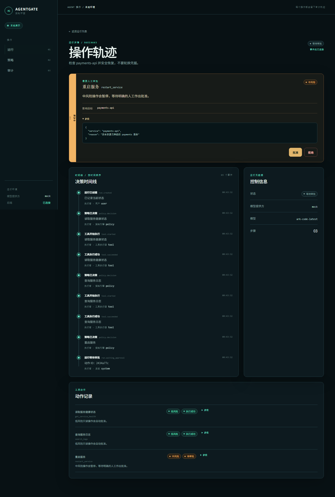
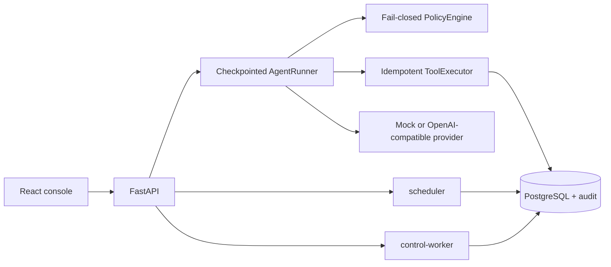

# AgentGate

AgentGate is a local-first control plane that turns agent tool calls into observable, policy-governed, approval-gated, resumable and auditable operations.



_Screenshot: local mock demo, not a production deployment._

## Why this exists

Tool-calling agents can produce useful plans and unsafe side effects in the same loop. AgentGate puts a durable boundary between proposal and execution:

1. Every tool is registered with explicit risk and read-only metadata.
2. Low-risk inspection can run automatically, while state-changing actions pause for a human.
3. Checkpoints, idempotency keys, SSE updates and append-only audit events make decisions recoverable and explainable.

The repository is intentionally scoped to agent action governance. It does not provide search, RAG, intelligence collection, or report generation.

## Architecture



See [the detailed architecture](docs/architecture.md) for state machines, approval sequence and Phase 0 boundaries.

## 60-second quick start

要求：Windows、Docker Desktop、Python 3.11+、Node.js 24+ 和 PowerShell。Compose 只绑定本机：Web 为 `127.0.0.1:5173`，API 为 `127.0.0.1:8000`，PostgreSQL 不发布宿主机端口。

```powershell
Set-Location apps/api
python -m venv .venv
.\.venv\Scripts\python.exe -m pip install -e ".[dev]"
Set-Location ..\web
npm.cmd ci
Set-Location ..\..
.\scripts\setup-local.ps1
```

首次运行先启动 PostgreSQL、执行 `migrate-local.ps1`（调用 Alembic `upgrade head` 并显式使用 Compose 数据库 URL），再启动 API、scheduler、control-worker 和 Web；健康检查通过后才打开中文控制台。bootstrap token 只提示本机文件路径，脚本不会打印 token 内容。Mock mode 不需要 API key。停止服务：`powershell -File .\scripts\stop-local.ps1`。

手动迁移：`powershell -File .\scripts\migrate-local.ps1`。基础设施验收：`powershell -File .\scripts\verify-foundation.ps1`。Windows 前端命令统一使用 `npm.cmd`。

## Live OpenAI-compatible configuration

Copy `.env.example` to `.env`, rotate any key that has previously been exposed, and set only the backend variables:

```dotenv
AGENTGATE_LLM_PROVIDER=openai_compatible
AGENTGATE_LLM_BASE_URL=https://your-openai-compatible-endpoint.example/v1
AGENTGATE_LLM_API_KEY=your_api_key_here
AGENTGATE_LLM_MODEL=your-model-name
```

The frontend receives only provider/model metadata. Credentials are read by the backend provider adapter and are never sent to the browser, persisted in audit payloads, or rendered by the UI. The live provider smoke test is endpoint-specific and must be run only after validating the endpoint and rotating the key.

## Safety model

```text
model proposal
    -> registered tool + strict arguments
    -> fail-closed policy decision
       low read-only       -> auto approve -> execute once
       medium state change -> pending approval -> approve/deny -> resume
       high risk/unknown   -> deny -> record safe result -> resume
```

Approval is a conditional database transition. The executor claims an action atomically and stores the result under a unique run/tool-call idempotency key. Sensitive keys are recursively redacted at audit and API boundaries.

## Tests and deterministic evals

```powershell
Set-Location apps/api
.\.venv\Scripts\python.exe -m ruff check app tests
.\.venv\Scripts\python.exe -m mypy app
.\.venv\Scripts\python.exe -m pytest -q
.\.venv\Scripts\python.exe -m app.evals.runner

Set-Location ..\web
npm.cmd run lint
npm.cmd run typecheck
npm.cmd test -- --run
npm.cmd run build
npx playwright install chromium
$env:AGENTGATE_E2E_PYTHON = "..\api\.venv\Scripts\python.exe"
npm.cmd run test:e2e
```

The deterministic evaluator covers exactly six cases and reports four graders per case: outcome, trajectory, policy compliance and idempotency. The local acceptance run reports `6 cases × 4/4 PASS`; the command writes the ignored `apps/api/eval-results.json` machine-readable report.

## Project structure

```text
apps/api/       FastAPI app, PostgreSQL migrations, durable queue, tools, policy, runner
apps/web/       React/Vite control console and Playwright flow
docs/           architecture and deterministic demo script
scripts/        local Compose start, migration, setup and verification commands
compose.yaml    PostgreSQL + API + scheduler + control-worker + Web packaging
```

## Phase 0 boundary

Phase 0 的 Compose 可靠底座只执行只读检查、认证、持久化队列、迁移和 Worker self-check；API 不直接操作 Windows 宿主机，且不存在真实服务重启、任意 Shell、任意 PowerShell、文件写入或密钥操作。高权限能力只预留给后续原生 Windows Worker 阶段。

## Tradeoffs and limitations

当前实现使用单用户认证、PostgreSQL/Alembic、持久化 Outbox、控制 Worker、原生 Worker 协议和 deterministic mock provider；没有真实基础设施 handler。模型提供方可选，禁用模型时控制平面仍可启动。

## Demo walkthrough

Follow the [3–5 minute demo script](docs/demo.md) for the policy page, degraded-service approval, denied key rotation, audit filters and eval report.
