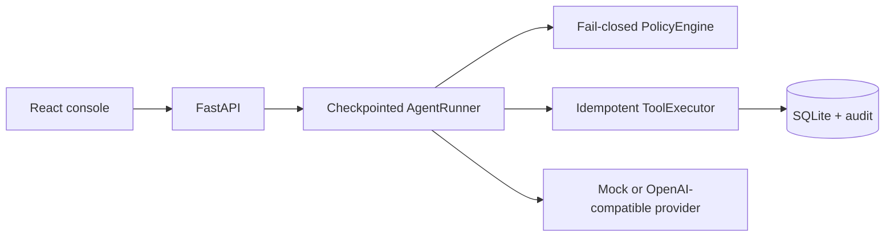

# AgentGate

AgentGate is a local-first control plane that turns agent tool calls into observable, policy-governed, approval-gated, resumable and auditable operations.


_Screenshot: local mock demo, not a production deployment._

## Why this exists

Tool-calling agents can produce useful plans and unsafe side effects in the same loop. AgentGate puts a durable boundary between proposal and execution:

1. Every tool is registered with explicit risk and read-only metadata.
2. Low-risk inspection can run automatically, while state-changing actions pause for a human.
3. Checkpoints, idempotency keys, SSE updates and append-only audit events make decisions recoverable and explainable.

The repository is intentionally scoped to agent action governance. It does not provide search, RAG, intelligence collection, or report generation.

## Architecture



See [the detailed architecture](docs/architecture.md) for state machines, approval sequence and production evolution.

## 60-second quick start

Requirements: Python 3.11+, Node.js 24+, and PowerShell on Windows.

```powershell
Set-Location apps/api
python -m venv .venv
.\.venv\Scripts\python.exe -m pip install -e ".[dev]"
Set-Location ..\web
npm ci
Set-Location ..\..
.\scripts\start-local.ps1 -Provider mock
```

Open [http://localhost:5173](http://localhost:5173). Mock mode is the default and requires no API key. Stop the local child processes with `./scripts/stop-local.ps1`.

## Live OpenAI-compatible configuration

Copy `.env.example` to `.env`, rotate any key that has previously been exposed, and set only the backend variables:

```dotenv
AGENTGATE_LLM_PROVIDER=openai_compatible
AGENTGATE_LLM_BASE_URL=https://your-openai-compatible-endpoint.example/v1
AGENTGATE_LLM_API_KEY=your_api_key_here
AGENTGATE_LLM_MODEL=your-model-name
```

The frontend receives only provider/model metadata. Credentials are read by the backend provider adapter and are never sent to the browser, persisted in audit payloads, or rendered by the UI. The live provider smoke test is endpoint-specific and must be run only after validating the endpoint and rotating the key.

## Safety model

```text
model proposal
    -> registered tool + strict arguments
    -> fail-closed policy decision
       low read-only       -> auto approve -> execute once
       medium state change -> pending approval -> approve/deny -> resume
       high risk/unknown   -> deny -> record safe result -> resume
```

Approval is a conditional database transition. The executor claims an action atomically and stores the result under a unique run/tool-call idempotency key. Sensitive keys are recursively redacted at audit and API boundaries.

## Tests and deterministic evals

```powershell
Set-Location apps/api
.\.venv\Scripts\python.exe -m ruff check app tests
.\.venv\Scripts\python.exe -m mypy app
.\.venv\Scripts\python.exe -m pytest -q
.\.venv\Scripts\python.exe -m app.evals.runner

Set-Location ..\web
npm run lint
npm run typecheck
npm test -- --run
npm run build
npx playwright install chromium
$env:AGENTGATE_E2E_PYTHON = "..\api\.venv\Scripts\python.exe"
npm run test:e2e
```

The deterministic evaluator covers exactly six cases and reports four graders per case: outcome, trajectory, policy compliance and idempotency. The local acceptance run reports `6 cases × 4/4 PASS`; the command writes the ignored `apps/api/eval-results.json` machine-readable report.

## Project structure

```text
apps/api/       FastAPI app, SQLite models, tools, policy, runner, evals
apps/web/       React/Vite control console and Playwright flow
docs/           architecture and deterministic demo script
scripts/        native local start, stop and verification commands
compose.yaml    API + nginx production-like local packaging
```

## Production evolution

Move persistence to PostgreSQL with migrations, use authenticated actors and RBAC, add durable event delivery, distributed action leases, a secret manager, versioned policies, isolated tool workers, provider telemetry, and tenant isolation. Keep the policy/executor boundary independent of the chosen model provider.

## Tradeoffs and limitations

The MVP intentionally uses one AgentRunner, SQLite, a process-local event broker, two simulated services and a deterministic mock provider. There is no authentication, multi-tenant isolation or real infrastructure handler. These constraints keep the interview demo reproducible and make safety behavior inspectable; they are not production readiness claims.

## Demo walkthrough

Follow the [3–5 minute demo script](docs/demo.md) for the policy page, degraded-service approval, denied key rotation, audit filters and eval report.
