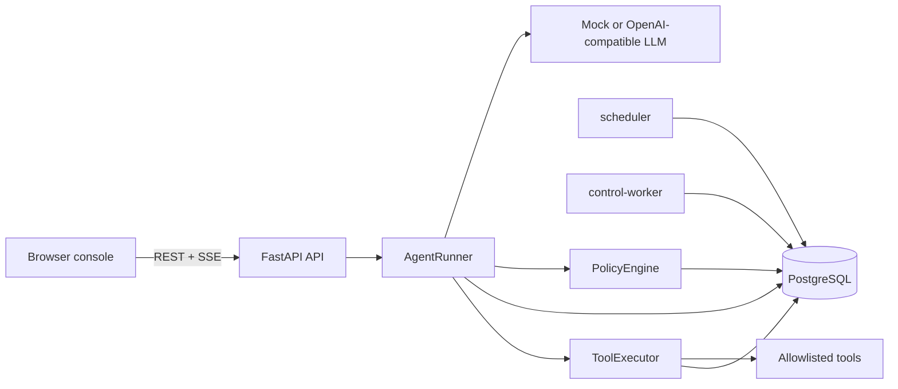
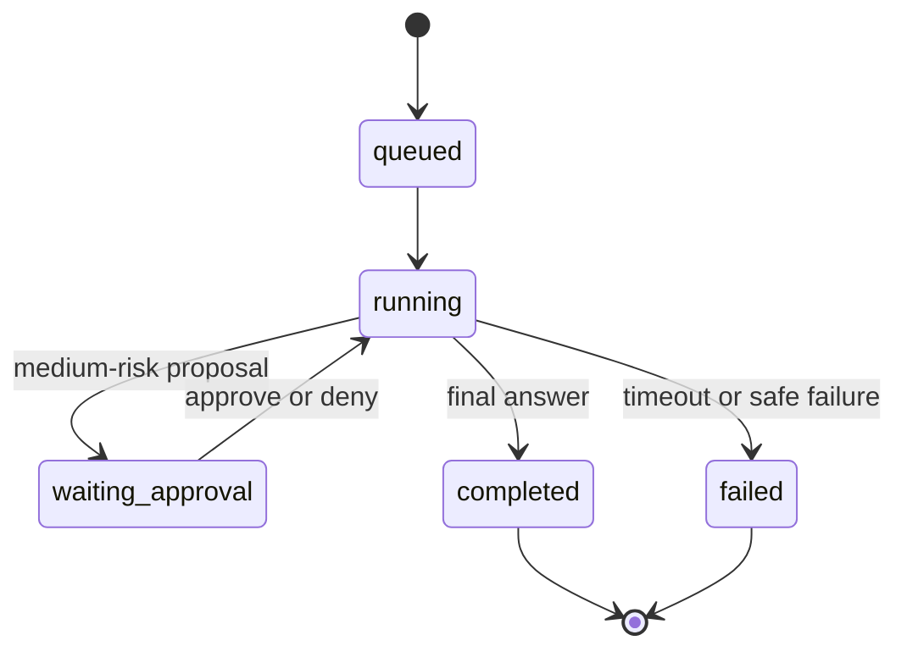
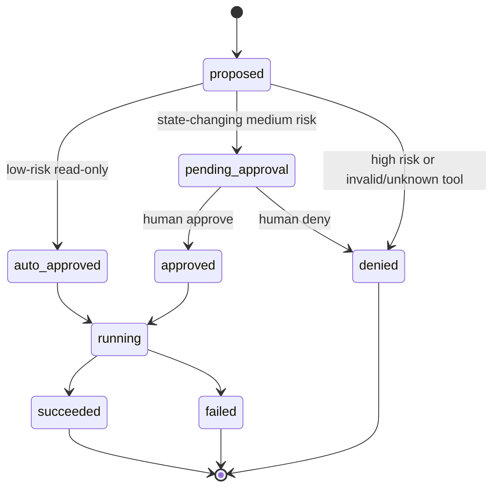
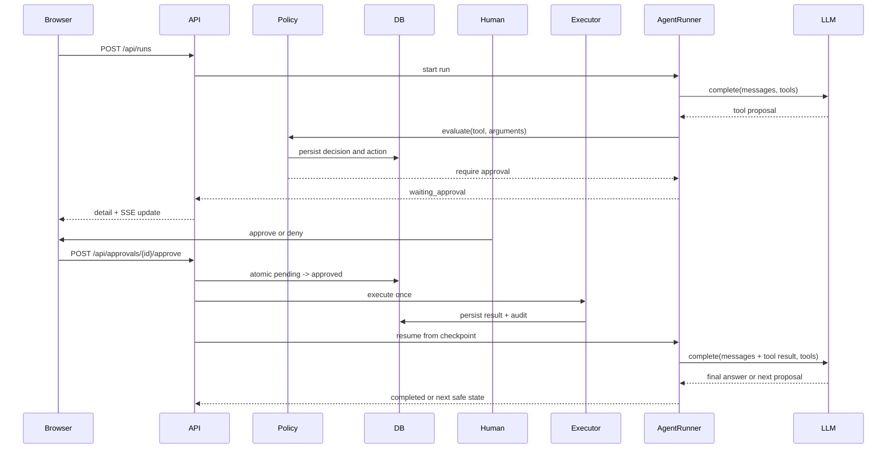

# AgentGate architecture

AgentGate is a local-first control plane for tool-calling agents. The model can propose an action, but the policy engine and persisted action state decide whether that proposal can execute.

## Context and components

The API owns run creation, detail reads, approvals, audit queries and the SSE stream. `AgentRunner` is the single stateful orchestration boundary: it loads a checkpoint, calls the provider-neutral LLM interface, validates tool arguments, routes through policy, and resumes after an approval decision.

## Run and action state machines

## Approval sequence

## Transaction and idempotency boundaries

- Run and action checkpoints are committed before the next provider call. A crash therefore leaves the conversation and step count available for resume.
- Policy decisions are persisted with the proposed action before an execution can begin.
- `ToolExecutor` claims an action with a conditional `pending/approved`-style transition to `running`. The unique `idempotency_key` is derived from run ID and model tool-call ID.
- A second execution request returns the persisted success or fails safely when another worker owns the running action. Only the first successful claim may invoke a handler.
- Approval is a conditional `pending_approval -> approved|denied` transition. Duplicate clicks return a conflict and do not resume the run a second time.
- Audit events are append-only records. Sensitive keys are recursively redacted before storage and again at API serialization boundaries.

## Why these choices

- **SSE:** run events are append-only and server-to-browser, so SSE keeps the console simple while still showing persisted state changes promptly. REST remains the source of truth after reconnect.
- **PostgreSQL + Alembic:** PostgreSQL is the only source of truth for runs, leases, workers and Outbox events. Compose runs migrations before API/Worker services; `SQLModel.metadata.create_all()` remains test-only.
- **Direct OpenAI SDK:** the adapter uses the official Python client for OpenAI-compatible chat completions while exposing only provider-neutral `ModelTurn` and `ToolCall` types to the agent loop.
- **One Agent:** a single runner keeps approval semantics, tool-call ordering and checkpoint recovery unambiguous for the MVP. Specialized agents can be added behind the same policy/executor boundary later.

## Local-demo limitations and production path

Phase 0 is deliberately local-only: Compose binds Web/API to loopback, PostgreSQL has no published host port, and no real host action exists. The API exposes health/self-check data without secrets; the scheduler recovers durable leases and the control-worker processes persisted control tasks. The native Windows Worker remains usable outside Docker for the safe `worker.self_check` protocol. Real service restarts, arbitrary shell/PowerShell, file writes and secret operations belong to later phases and are not implemented here.
