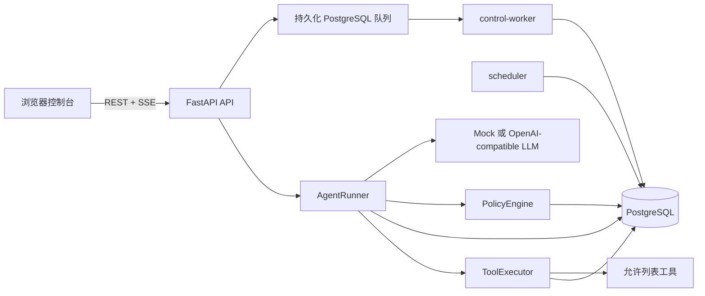
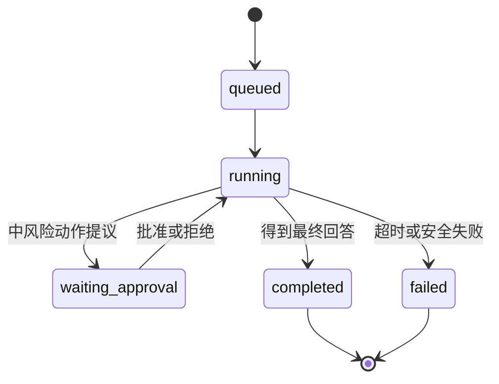
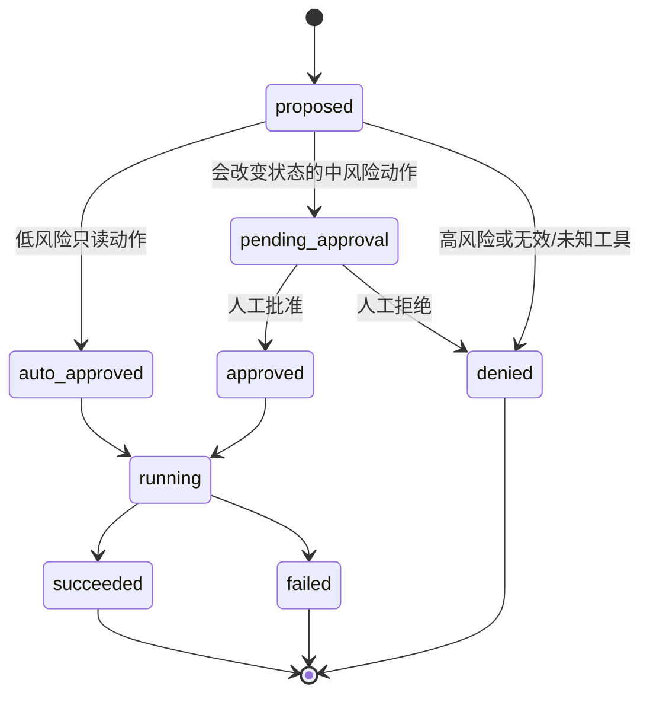
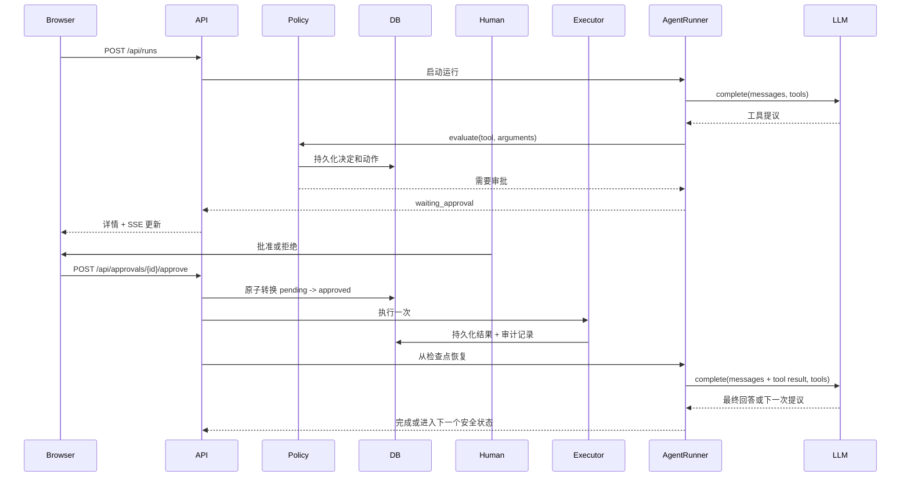

# AgentGate 架构说明

AgentGate 是一个面向本机的 Tool-calling Agent 控制平面。模型可以提出动作，但是否允许执行由策略引擎和持久化的动作状态共同决定。

## 上下文与组件

API 负责创建运行、读取详情、处理审批、查询审计记录和提供 SSE 流。`AgentRunner` 是唯一的有状态编排边界：它加载检查点、调用与提供方无关的 LLM 接口、校验工具参数、将动作送入策略判断，并在审批决定后恢复运行。

## 运行和动作状态机

## 审批顺序

## 事务与幂等边界

- 运行和动作检查点会在下一次调用模型提供方之前提交。发生崩溃时，会话和步骤数仍然可以用于恢复。
- 策略决定会与动作提议一起持久化，之后才允许开始执行。
- `ToolExecutor` 通过条件状态转换领取动作，将 `pending/approved` 状态转换为 `running`。唯一的 `idempotency_key` 由运行 ID 和模型工具调用 ID 推导得到。
- 第二次执行请求会返回已持久化的成功结果；如果动作已由其他 Worker 执行，则安全失败。只有第一个成功领取动作的执行者可以调用处理器。
- 审批是条件转换 `pending_approval -> approved|denied`。重复点击返回冲突，不会让运行恢复两次。
- 审计事件是追加式记录。敏感字段会在存储前递归脱敏，并在 API 序列化边界再次脱敏。

## 设计选择

- **SSE：**运行事件是追加式、从服务端发送到浏览器的事件，因此 SSE 可以保持控制台简单，同时及时展示已持久化的状态变化。重新连接后，REST 仍然是事实来源。
- **PostgreSQL + Alembic：**PostgreSQL 是运行、租约、Worker 和 Outbox 事件的唯一事实来源。Compose 会在 API/Worker 服务前执行迁移；`SQLModel.metadata.create_all()` 仅用于测试。
- **直接使用 OpenAI SDK：**适配器使用官方 Python 客户端调用 OpenAI-compatible Chat Completions，但对 Agent 循环只暴露与提供方无关的 `ModelTurn` 和 `ToolCall` 类型。
- **单 Agent：**单一 Runner 让 MVP 的审批语义、工具调用顺序和检查点恢复保持明确。后续可以在同一个策略/执行器边界之后增加专用 Agent。

## 本地演示限制与生产演进路径

Phase 0 刻意限制为本地运行：Compose 将 Web/API 绑定到回环地址，PostgreSQL 不发布宿主机端口，也不存在真实宿主机动作。API 提供不包含密钥的健康和自检数据；scheduler 负责恢复持久化租约，control-worker 处理持久化控制任务。原生 Windows Worker 可以在 Docker 外使用，但仅支持安全的 `platform.self_check` 协议。真实服务重启、任意 Shell/PowerShell、文件写入和密钥操作属于后续阶段，当前尚未实现。

本地端口约定：`AGENTGATE_API_PORT` 默认是 `8000`，`AGENTGATE_WEB_PORT` 默认是 `5173`。Compose 只发布 `127.0.0.1:<port>`；API 根据 Web 端口生成 CORS 来源，Vite 根据 API 端口生成开发代理和 API 基地址，构建后的 Web 容器也使用同一份 Compose 解析出的运行时 API 地址。只支持 `localhost`/`127.0.0.1` 目标。
