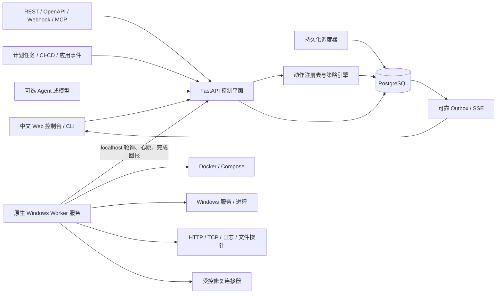
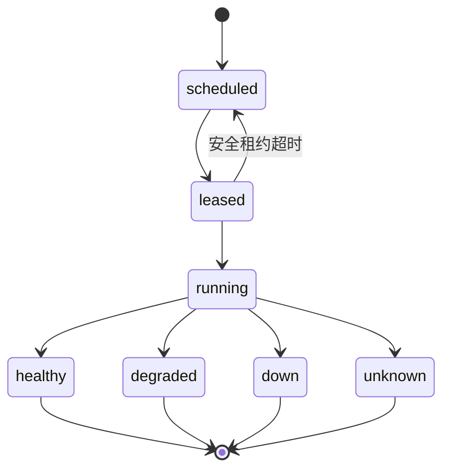
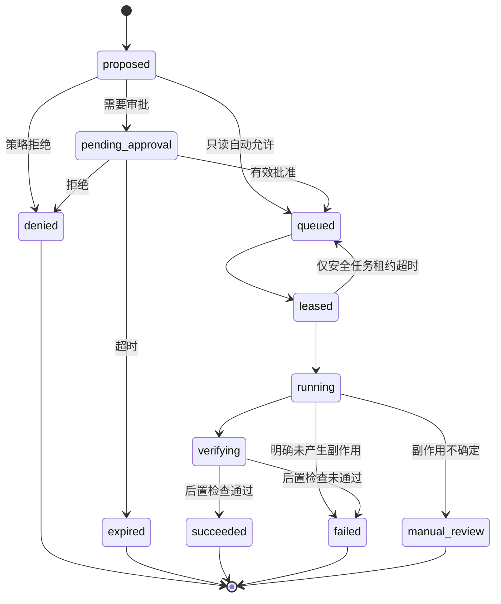

# AgentGate 本地管控平台设计

- 日期：2026-08-31
- 状态：设计已在会话中逐节确认，等待书面规格复核
- 目标仓库：`agentgate-control-plane`
- 适用范围：单台 Windows 主机、单用户、仅本机访问

## 1. 摘要

AgentGate 不再定位为另一个通用 Agent，也不绑定 Codex、Ark 或任何大模型。它是独立于调用方和模型的本地动作安全网关：接收结构化事件、检查任务和动作请求，执行确定性策略，要求必要的人工审批，通过受限原生 Worker 操作本机目标，并持久化完整证据。

系统在没有大模型时也必须完整工作。Codex、MCP 客户端、Ark、其他 Agent、脚本和 CI/CD 都只是可选接入端。任何模型输出只能成为分析或动作建议，不能成为执行权限、审批结论或成功证据。

首个真实可用版本覆盖：

1. Docker/Compose、Windows 服务和 HTTP 目标的持续监控。
2. 异常去重、恢复判定、中文告警和事件时间线。
3. 审批后重启白名单容器或 Windows 服务。
4. PostgreSQL 持久化、可靠任务队列、Worker 租约、幂等执行和崩溃恢复。
5. 修复后的独立健康复查与追加式审计记录。

## 2. 背景与现状

当前仓库是可复现的本地演示：FastAPI、React/Vite、SQLite、进程内 SSE、FastAPI 请求内后台任务、模拟服务工具，以及 Mock/OpenAI-compatible 模型适配器。它已经验证了动作提议、策略判断、人工审批、幂等声明、时间线和审计的产品方向，但不能安全地管理真实基础设施。

影响真实使用的主要差距是：

- 工具处理器只修改数据库中的模拟服务状态。
- SQLite、进程内事件代理和请求内后台任务无法承担长期运行与崩溃恢复。
- 没有真实身份认证，操作人来自请求内容。
- 策略主要按工具名称和静态风险分类，缺少参数、目标和策略版本约束。
- 没有原生 Windows 权限边界、Worker 身份、租约、可靠消息、审批过期和副作用不确定状态。
- AgentRunner 是主流程，导致产品入口看起来依赖大模型。
- 没有安装、开机自启、备份恢复、升级回滚和系统自检。

本设计保留现有审批、安全和审计思想，但将核心从“Agent 运行器”转为“协议中立的本地管控平台”。

## 3. 产品边界

### 3.1 目标

- 不依赖任何模型提供商，支持人工、系统和智能客户端统一接入。
- 默认只监听 localhost，并面向单台 Windows 主机和单个操作人。
- 只读监控可以自动运行，任何真实状态变更必须遵循确定性策略。
- 高权限执行集中在受限原生 Windows Worker 中，Web/API 容器不直接获得宿主机管理权限。
- 每个动作都可解释、可审批、可恢复、可验证、可审计。
- 新增监控对象时通过连接器扩展，不修改核心状态机和审批语义。
- 提供完整中文操作界面，日常使用不要求理解 API、容器命令或模型工具调用。

### 3.2 非目标

- 不开发通用聊天 Agent、代码编辑器、桌面控制或浏览器自动化。
- 不提供任意 Shell、任意 PowerShell、任意路径、任意网络请求或任意脚本执行。
- 首版不做多用户、RBAC、OIDC、多租户、远程主机或企业审批组织结构。
- 首版不自动执行重启、文件修改或维护脚本。
- 不把 AgentRunner、MCP 或模型调用作为监控与修复的必需依赖。
- 不在首版建设通用指标时序数据库、日志分析平台或分布式编排平台。

### 3.3 隐私和网络边界

- 默认不向外部服务发送遥测、日志、文件内容或监控数据。
- 外部模型调用默认关闭；启用后只发送用户明确选择的上下文。
- HTTP 探针只能访问已注册且匹配允许范围的目标。
- Worker 不提供通用网络客户端；未注册地址和端口一律拒绝。
- 密钥只以引用形式出现在业务记录中，不进入浏览器、审计载荷或普通日志。

## 4. 方案比较与选择

### 4.1 Codex/模型优先

以 Codex、MCP 或某个模型作为主要入口，模型提出动作后进入审批。实现快，但产品会被误认为模型附属工具；没有模型时无法独立监控，未来接入脚本、CI/CD 和其他事件源也会受限。

结论：不采用为核心架构，只保留为可选适配器。

### 4.2 独立网页直接执行

由中文控制台直接调用 Docker、Windows 服务和文件系统。操作直观，但 Web/API 必须持有高权限，难以隔离权限，也不能自然服务外部程序。

结论：不采用。网页只操作控制平面，不直接触达宿主机权限。

### 4.3 通用 API 核心 + 中文控制台 + 受限 Worker

使用协议中立 API 接收结构化事件和动作；中文控制台承担配置、告警和审批；原生 Worker 仅实现白名单连接器。模型、MCP、Webhook、CLI 和计划任务都作为适配器接入。

结论：采用。该方案同时满足模型无关、真实本机管理、权限隔离和可扩展性。

## 5. 系统架构

### 5.1 部署拓扑

Docker Compose 运行以下低权限服务：

- `web`：静态 React 中文控制台，由 Nginx 提供。
- `api`：REST、认证、审批、查询和 Worker 协议。
- `scheduler`：使用与 API 相同的应用镜像，独立进程负责到期检查任务和租约维护。
- `postgres`：唯一事实来源，不向宿主机发布数据库端口。

Windows 宿主机运行一个原生 Worker 服务：

- 只主动轮询 localhost API，不开放高权限监听端口。
- 使用单独的低权限 Windows 服务账号启动。
- 只有具体连接器需要的最小权限；不得默认以完整管理员权限运行。
- Docker 和 Windows 服务连接器分别进行能力检测和权限诊断。

Web 和 API 端口绑定 `127.0.0.1`。远程访问不属于本设计；未来如需远程管理，必须单独设计 TLS、身份、授权和网络边界。

## 6. 组件职责

### 6.1 中文控制台

控制台提供以下一级页面：

- 总览：目标健康度、活动事件、待审批动作、Worker 和平台状态。
- 目标：注册、启停和检查 Docker/Compose、Windows 服务和 HTTP 目标。
- 事件：查看异常证据、影响范围、发生次数、恢复状态和关联动作。
- 审批：显示动作类型、目标、参数、风险解释、策略版本、过期时间和预期影响。
- 动作：查看执行尝试、受限输出、后置检查和人工核验状态。
- 审计：按时间、目标、动作、结果和来源过滤追加式事件。
- 系统：连接器能力、Worker 心跳、备份状态、版本和自检结果。

所有状态和错误使用中文展示，同时保留可复制的英文错误码。危险按钮必须明确目标和影响，不使用模糊的“确认”文案。

### 6.2 API 控制平面

API 负责：

- 认证浏览器、CLI、外部适配器和 Worker。
- 验证所有请求 Schema、来源身份、幂等键和资源版本。
- 规范化事件、检查任务和动作请求。
- 执行策略、创建审批、维护状态转换和写审计事件。
- 提供可靠事件读取；SSE 仅是通知通道，REST 和数据库仍是事实来源。
- 向 Worker 提供认领、心跳、开始、完成和放弃租约协议。

API 不直接操作 Docker、Windows 服务、文件系统或宿主机命令。

### 6.3 调度器

调度器按数据库中的探针定义创建到期检查任务。多个调度实例必须通过数据库约束和抢占锁避免重复入队。调度器不执行探针，也不持有宿主机权限。

### 6.4 动作注册表

每种动作在代码中注册以下不可缺少的元数据：

- 稳定动作名称和版本。
- 参数 JSON Schema。
- 风险级别和只读标记。
- 支持的目标类型。
- Worker 所需能力。
- 输出大小、超时和重试语义。
- 是否幂等、崩溃后能否安全重试。
- 后置验证探针。

数据库保存启用状态和策略覆盖，但不能创建注册表中不存在的任意动作。

### 6.5 策略引擎

策略输入包括：来源身份、动作类型和版本、目标、规范化参数、目标标签、当前事件、当前状态、审批历史和策略版本。

策略只返回：

- `allow_auto`：只读、低风险且参数完全匹配白名单。
- `require_approval`：允许提出，但执行前必须获得有效审批。
- `deny`：未知、越界、高风险或策略配置无效。

策略决定和原因必须与动作请求在同一事务中保存。执行前 Worker 领取流程会再次验证策略版本、审批摘要和目标版本。

### 6.6 原生 Worker

Worker 负责：

- 定期上报版本、连接器能力、心跳和当前租约。
- 认领与自身能力匹配的检查或动作任务。
- 在执行前再次验证签名摘要、动作版本、目标范围和参数。
- 对有副作用动作调用“开始执行”接口；只有收到已持久化的短期执行授权后才调用连接器。
- 在受限本机数据目录维护执行日志，先记录开始授权和请求摘要，再记录结果；API 暂时不可用时保留待回报结果。
- 以限制时间、限制输出和限制权限运行连接器。
- 分块或截断输出，进行本地脱敏后再回报。
- 对修复动作运行独立后置探针。

Worker 不解释自然语言，不调用模型，不接受任意命令字符串。

## 7. 接入协议

核心接入对象分为三类：

1. `Event`：外部系统报告的事实或告警，不直接产生权限。
2. `CheckRequest`：请求执行一个已注册只读探针。
3. `ActionRequest`：请求执行一个已注册动作。

建议的稳定 API 前缀为 `/api/v1`。首批接口包括：

- `POST /events`：提交结构化外部事件。
- `POST /checks`：请求一次已注册检查。
- `POST /actions`：提出动作请求，不代表允许执行。
- `GET /targets`、`GET /incidents`、`GET /actions/{id}`：读取当前状态。
- `POST /approvals/{id}/approve`、`POST /approvals/{id}/deny`：条件式审批转换。
- `GET /events/stream`：使用事件游标恢复的 SSE 通知。
- `/worker/v1/*`：Worker 注册、轮询、租约、心跳和结果回报。

所有创建接口要求客户端提供幂等键。外部适配器不能指定最终策略结论、执行状态、审批人或审计字段。

CLI、Webhook 和其他外部适配器使用独立的可吊销访问令牌。令牌只保存摘要，并按“提交事件”“请求检查”“提出动作”等能力授权；外部适配器令牌不能批准动作、注册 Worker 或修改策略。

MCP、模型 SDK 和 CLI 后续仅将各自请求翻译为上述对象，不拥有旁路执行协议。

## 8. 数据模型

### 8.1 核心实体

- `managed_target`：名称、类型、连接器、规范化定位信息、标签、启用状态、策略集、乐观锁版本。
- `probe_definition`：目标、探针类型、受限配置、周期、超时、失败阈值、恢复阈值和启用状态。
- `observation`：探针、序号、状态、开始与结束时间、受限证据、错误分类和 Worker。
- `incident`：去重键、目标、探针、严重度、状态、首次/最后出现时间、次数和恢复时间。
- `action_request`：动作类型与版本、目标、规范化参数、参数摘要、来源、策略版本、风险、幂等键和状态。
- `approval`：动作、决定、参数摘要、操作人、理由、创建时间、过期时间和决定时间。
- `execution_attempt`：动作、尝试号、Worker、租约、开始/结束时间、结果、受限输出、错误分类和副作用确定性。
- `policy_version`：不可变策略快照、摘要、激活时间和校验状态。
- `worker_registration`：Worker 身份、令牌摘要、能力、版本、最后心跳和状态。
- `audit_event`：不可更新的领域事件、操作人、资源、结果、脱敏载荷和时间。
- `outbox_event`：与业务事务同提交的待发布通知和单调事件游标。

### 8.2 约束

- `action_request.idempotency_key` 在来源范围内唯一。
- 一个动作最多有一个当前有效的批准决定。
- 审批记录中的参数摘要必须等于动作执行时的规范化参数摘要。
- 同一去重键最多存在一个活动事件。
- 同一任务同一时间最多有一个未过期租约。
- 执行尝试不可覆盖历史尝试。
- 审计事件不提供更新和删除业务接口。
- 业务状态和对应 Outbox 事件必须在同一数据库事务中提交。

## 9. 状态机与数据流

### 9.1 观测与事件

连续失败达到配置阈值后才创建或更新事件。恢复也要求达到恢复阈值。探针自身无法运行时记录 `unknown`，不能把“无法观测”误报为目标宕机。

### 9.2 动作与审批

审批后任何参数、目标或动作版本变化都会使审批失效。有副作用动作在 Worker 崩溃或连接中断后进入 `manual_review`，不得自动再次执行。

### 9.3 完整修复流程

1. 调度器创建只读检查任务。
2. Worker 执行受限探针并保存观测证据。
3. 控制平面执行失败阈值、恢复阈值和事件去重。
4. 异常事件展示预注册修复建议；建议可由规则、人或可选智能客户端产生。
5. 策略按动作、目标和参数生成拒绝或待审批记录。
6. 用户批准的决定与参数摘要绑定并设置过期时间。
7. Worker 认领任务、执行前复核、单次执行并保存尝试记录。
8. Worker 运行独立健康探针。
9. 复查通过后动作成功并关闭事件；否则保留事件并记录失败或人工核验状态。

## 10. 安全策略

### 10.1 风险矩阵

| 类别 | 默认行为 | 额外约束 |
|---|---|---|
| 状态、端口、HTTP 健康和有限日志读取 | 自动执行 | 目标、路径、输出、超时全部白名单 |
| 重启容器或 Windows 服务 | 每次审批 | 仅预注册目标，审批过期，执行后独立复查 |
| 文件写入、移动或删除 | 每次审批 | 差异预览、精确路径、执行前备份、恢复入口 |
| 预注册维护脚本 | 每次审批 | 管理员预注册脚本摘要、固定参数 Schema、禁止拼接命令 |
| 密钥读取或轮换、任意 Shell/PowerShell、任意网络请求 | 永久拒绝 | 不提供处理器和旁路接口 |

文件和脚本能力属于阶段 4，不进入首个可用版本。

### 10.2 参数和路径约束

- 所有参数先规范化再计算摘要和执行策略。
- 不允许客户端传递可执行命令行、Shell 片段或解释器参数数组。
- 文件连接器使用解析后的绝对路径，并验证路径位于精确注册根目录内。
- 网络目标使用注册后的 Scheme、主机、端口和路径范围；重定向默认关闭。
- 输出按连接器设置字节和行数上限，超限时截断并记录截断事实。

### 10.3 操作人认证

即使只监听 localhost，也需要浏览器身份认证，防止恶意网页利用本机浏览器跨站触发操作。

- 首次安装生成一次性本机设置令牌，用户据此创建唯一操作人密码。
- 密码使用 Argon2id 保存摘要。
- 浏览器使用 `HttpOnly`、`SameSite=Strict` 会话 Cookie。
- 所有状态变更接口要求 CSRF 令牌并校验精确 Origin。
- 登录、失败登录、注销、审批和设置变更写入审计事件。

### 10.4 Worker 身份和秘密

- Worker 使用一次性注册令牌完成本机配对。
- 长期 Worker 凭据使用 Windows DPAPI 保护；API 数据库只保存不可逆摘要。
- Worker 凭据可轮换和吊销。
- Worker 本机执行日志位于仅服务账号可访问的目录，只保存任务标识、摘要、状态和已脱敏受限结果；成功回报并确认后按保留策略清理。
- 模型 API Key 继续只存在后端环境或专用秘密引用中，不进入前端。
- 日志、API 序列化和审计写入前执行统一递归脱敏。

## 11. 可靠性与错误处理

| 故障 | 系统行为 |
|---|---|
| PostgreSQL 不可用 | API 拒绝状态变更；Scheduler 和 Worker 停止认领；不执行动作 |
| API 重启 | 已提交事务保留；Worker 退避重连；浏览器通过 REST 和游标恢复 |
| Scheduler 重启 | 从数据库重新计算到期任务；唯一约束防止重复入队 |
| Worker 离线 | 任务保持队列；控制台产生平台告警；不回退到 API 直接执行 |
| 只读探针执行中崩溃 | 租约过期后允许按策略重试 |
| 有副作用动作执行中崩溃 | 标记副作用不确定并进入人工核验，不自动重试 |
| Worker 获得执行授权后 API 断线 | Worker 按授权最多调用一次连接器，将结果写入本机执行日志，重连后回报；授权前断线则不执行 |
| 审批过期或摘要不匹配 | 拒绝认领或执行，要求重新审批 |
| 策略配置无效或版本不一致 | 默认拒绝，不降级放行 |
| SSE/浏览器断线 | Outbox 保留事件；客户端用最后事件游标补发并重新获取 REST 状态 |
| 后置检查失败 | 动作不标记成功，事件保持活动并显示执行证据 |
| 连接器输出超限 | 截断、标记、脱敏；不能导致 Worker 或 API 内存无限增长 |

重试必须有上限、指数退避和抖动。用户拒绝、策略拒绝和参数错误不重试。

## 12. 观测和平台自检

平台需要区分“被监控目标异常”和“AgentGate 自身异常”。系统页至少展示：

- API、Scheduler、PostgreSQL、Outbox 和 Worker 健康状态。
- Worker 版本、能力、最后心跳、当前租约和连接器诊断。
- 检查任务延迟、队列深度、事件数量和失败分类。
- 最近备份、最近恢复演练和当前数据库迁移版本。
- 当前策略版本和注册动作版本。

应用日志使用结构化 JSON，包含关联 ID，但不包含密钥、完整文件内容或未截断工具输出。首版不向外部遥测服务上传数据。

## 13. 测试策略

### 13.1 单元测试

- 参数规范化、摘要、Schema 校验和路径边界。
- 策略风险矩阵、默认拒绝和策略版本行为。
- 动作、审批、租约、事件去重和恢复状态机。
- 幂等键、输出截断和递归脱敏。
- 探针失败阈值、恢复阈值和 `unknown` 行为。

### 13.2 集成测试

- PostgreSQL 事务、Alembic 升降级、唯一约束和并发声明。
- API、Scheduler、Worker 协议、租约续期和 Outbox 发布。
- API/Worker/数据库分别重启后的恢复。
- Worker 在获得执行授权前后分别断线时，本机执行日志和结果补报行为。
- 重复请求、重复审批、审批过期和参数篡改。
- Worker 身份注册、轮换、吊销和无效凭据。

### 13.3 真实连接器测试

- 在隔离测试 Compose 项目中验证状态、停止、异常、审批重启和健康复查。
- 在专用无害 Windows 测试服务上验证状态查询、审批重启和权限不足。
- 使用本地测试 HTTP 服务验证超时、错误码、响应过大、重定向和恢复。
- 真实连接器测试不得操作用户现有服务。

### 13.4 端到端与故障注入

- 中文控制台覆盖目标注册、事件查看、批准、拒绝、过期和审计过滤。
- 在执行前、执行中和后置检查期间终止 Worker，验证对应恢复状态。
- 在事件发布期间中断浏览器，验证游标补发。
- 并发提交相同幂等键，验证只产生一个动作和一次副作用。
- 对任意命令、未知动作、越界路径、未注册网络目标和密钥字段执行拒绝测试。

### 13.5 长时间测试

阶段 1 需要至少 24 小时本机稳定性测试，期间模拟目标抖动、短暂断连和恢复。验收要求没有无限队列增长、重复活动事件、失联租约或未解释的任务状态。

## 14. 分阶段路线

本项目包含持久化、调度、原生 Worker、真实连接器、安装运维和外部适配器等多个子系统，不适合用一个超大实施计划同时开发。本文是统一产品与架构规格；每个阶段使用独立实施计划和验收门槛。书面规格获批后只为阶段 0 编写第一份详细实施计划，阶段 0 验收完成后再规划阶段 1，依次推进。

### 阶段 0：可靠底座

范围：

- 引入 PostgreSQL 和 Alembic。
- 建立可靠任务、租约、Outbox、Worker 注册和平台自检模型。
- 将浏览器身份改为服务端会话与 CSRF 防护。
- 创建原生 Windows Worker 骨架和能力协议。
- 从 FastAPI `BackgroundTasks` 和进程内事件代理迁移。
- 保留当前模拟工具作为测试夹具，而不是生产处理器。

验收：

- API、Scheduler 和 Worker 重启后任务可恢复。
- 并发和重复请求不会造成重复执行。
- 数据库不可用时所有状态变更默认拒绝。
- 现有 Mock 演示和核心策略测试继续通过，或由等价新测试替代。

### 阶段 1：监控 MVP

范围：

- 目标和探针管理。
- Docker/Compose、Windows 服务和 HTTP 只读连接器。
- 周期调度、观测状态、失败/恢复阈值和事件去重。
- 中文总览、目标、事件和系统健康页面。

验收：

- 能注册一个隔离 Compose 服务、一个无害 Windows 测试服务和一个 HTTP 目标。
- 连续失败达到阈值后只生成一个活动事件。
- 目标恢复达到阈值后事件自动关闭。
- 探针故障显示 `unknown`，不会误报目标宕机。
- 完成 24 小时稳定性测试。

### 阶段 2：受控修复，首个真实可用版本

范围：

- 版本化动作注册表、参数级策略和审批过期。
- Docker/Compose 服务重启和 Windows 服务重启。
- 动作幂等、执行尝试、崩溃不确定状态和独立健康复查。
- 中文审批、动作和审计时间线。

验收：

- 完成“发现异常 → 提出动作 → 审批 → 单次执行 → 独立复查 → 关闭事件”全链路。
- 拒绝、过期或参数被修改时没有系统副作用。
- Worker 在副作用期间崩溃时不会盲目重试。
- 任意 Shell、PowerShell、未知动作和越权目标均被拒绝并审计。

### 阶段 3：本地长期运维

范围：

- 安装、卸载、开机自启、版本检查、升级和回滚流程。
- PostgreSQL 自动备份、保留策略和人工恢复演练。
- 连接器诊断、Worker 凭据轮换和平台故障排查。
- 完整中文安装、使用、备份、恢复和排障手册。

验收：

- 在干净 Windows 测试环境完成安装。
- 主机重启后平台和 Worker 自动恢复。
- 从备份恢复到可登录、可查看历史、可继续监控的状态。
- 升级失败可回滚到上一兼容版本。

### 阶段 4：开放扩展

范围：

- 进程、TCP、有限日志和文件完整性监控。
- 文件差异预览、执行前备份和受控恢复。
- 按内容摘要预注册的维护脚本。
- REST/Webhook、CLI、MCP 和其他客户端适配器。
- 可选模型分析和修复建议，仍不授予执行权限。

验收：

- 每个新连接器通过统一契约、安全、故障注入和输出限制测试。
- 文件操作必须展示精确差异并成功创建可验证备份。
- 脚本内容或参数 Schema 变化后旧审批和旧注册立即失效。
- 禁用所有模型配置后平台功能不受影响。

## 15. 从当前演示迁移

- 保留 React/FastAPI 技术栈和现有中文组件，逐页迁移到目标、事件、审批、动作和系统领域。
- 将现有 `AgentRunner` 降为可选“智能客户端适配器”；核心监控和动作 API 不依赖它。
- 将 `PolicyEngine` 拆分为动作注册表、参数规范化和版本化策略评估三个边界。
- 将 `ToolExecutor` 的处理器移入 Worker 连接器；API 仅管理动作状态和租约。
- 将进程内 SSE 事件代理替换为 PostgreSQL Outbox 和游标读取。
- 将 SQLite `create_all()` 替换为 Alembic 管理的 PostgreSQL Schema。
- 当前模拟 SQLite 数据不视为生产数据。阶段 0 默认创建新的 PostgreSQL 数据库，不承诺导入演示记录。
- 当前 Mock Provider 和评估用例继续作为确定性测试资产。

迁移期间允许保留旧 `/api/runs` 演示流程，但新控制平面使用 `/api/v1`。当新审批和动作链路覆盖原有演示能力后，再删除旧入口；删除需要单独的兼容性检查。

## 16. 安装、备份与升级原则

- Compose 配置必须将 Web/API 端口显式绑定 localhost，PostgreSQL 不发布宿主机端口。
- Worker 安装器创建专用服务账号、数据目录、日志目录和 DPAPI 凭据。
- 安装前执行 Docker、端口、文件权限、Windows 服务权限和数据库卷检查。
- 备份至少包含 PostgreSQL 逻辑备份、平台版本、Schema 版本和非秘密配置导出。
- 恢复流程先验证备份完整性，再停止写入、恢复数据库、运行兼容迁移和系统自检。
- 升级前自动备份；迁移失败时停止新版本并恢复兼容版本，不继续带错运行。
- 不把 API Key、Worker 明文令牌或密码包含在普通配置导出中。

## 17. 完成定义

阶段 2 结束时，项目才可以称为“真实本地可用”：

- 日常监控不需要启动 Codex、大模型或开发终端。
- 用户能在中文界面管理目标、查看异常、审批修复和验证结果。
- Docker/Compose、Windows 服务和 HTTP 监控使用真实连接器。
- 所有状态在进程和浏览器重启后保持一致。
- 所有有副作用动作均经过有效审批，并且最多执行一次或进入明确人工核验状态。
- 安全拒绝、失败原因和恢复行为都有自动化测试证据。

阶段 3 结束时，项目才可以称为“适合长期无人值守本机运行”：

- 主机重启可自动恢复。
- 可备份、恢复、升级和回滚。
- 平台自身故障与目标故障可以明确区分。
- 安装、使用和排障流程有经过验证的中文文档。

## 18. 已确认决策与延后项

已确认：

- 单机、单用户、localhost。
- Docker Web/API/Scheduler/PostgreSQL + 原生 Windows Worker。
- 模型无关的通用 API 核心。
- 只读监控自动执行；重启每次审批。
- 文件操作要求审批、预览和备份；固定脚本要求预注册和审批。
- 任意命令、任意网络、密钥操作永久拒绝。
- PostgreSQL 是唯一事实来源，Worker 只主动轮询。

明确延后：

- 多用户、RBAC、OIDC、多租户和远程主机。
- 自动修复策略。
- 文件变更、固定脚本和 MCP 接入。
- 外部通知渠道、通用指标平台和高级日志分析。
- 审计事件的密码学防篡改链和外部不可变存储。

任何延后项进入实施前都需要新的设计批准，不能通过配置暗中扩大首版权限边界。
