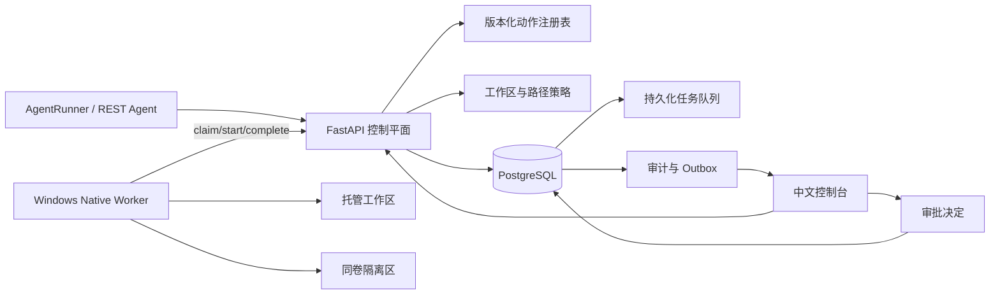

# AgentGate 真实文件动作治理设计

- 日期：2026-09-04
- 状态：已完成方向确认，等待书面规格复核
- 目标仓库：`agentgate-control-plane`
- 产品用途：AI Agent 开发与 AI 产品岗位面试作品，同时提供可真实使用的本机安全动作网关
- 首版平台：Windows 11、单机、单用户、仅回环地址

## 1. 摘要

AgentGate 保持“模型无关的 Agent 动作控制平面”定位，但把首个真实价值闭环收缩到文件动作治理。任何已接入 Agent 可以通过 REST API 或现有 AgentRunner 提出文件动作；控制平面负责参数校验、路径策略、风险决策、人工审批、持久化队列和审计，原生 Windows Worker 只执行预注册、严格限界的文件连接器。

首版不会尝试拦截整台 Windows 上任意程序的文件操作。它只对经过 AgentGate 提交的动作提供强制策略，并只在管理员预先登记的工作区内执行。这个边界必须在界面、README 和演示中明确展示。

首个完整演示必须执行真实文件操作，而不是修改数据库中的模拟状态：读取文件元数据可以自动通过；请求隔离受保护文件会被直接拒绝；请求隔离普通文件必须等待人工审批；批准后 Worker 将文件移动到隔离区；用户可以恢复文件；重复请求不会重复产生副作用。

## 2. 为什么采用这个方向

当前项目已经具备 React 控制台、FastAPI、PostgreSQL、策略决策、人工审批、持久化任务、Worker 租约、幂等执行、审计和监控，但主要业务工具仍是模拟操作，本机监控也只能证明服务健康。工程复杂度已经足够高，缺少的是一个能够在五分钟内证明控制平面价值的真实动作闭环。

为整台 Windows 实现透明文件拦截需要内核 Minifilter 或等价系统组件，安装、签名、兼容性和稳定性成本不符合个人作品范围。文件监听只能事后观察；Git worktree 只能隔离工作目录；Defender 受控文件夹按应用授权，无法表达每次动作的人工审批。首版因此选择“接入式强制治理”：Agent 主动把动作交给 AgentGate，AgentGate 是该动作唯一执行者。

这个范围同时服务两类面试目标：

- Agent 开发：展示工具调用协议、确定性策略、持久化任务、Worker 安全执行、崩溃恢复和测试。
- Agent 产品：展示风险分级、人在回路、拒绝解释、可恢复执行、用户体验和产品边界。

## 3. 用户与核心任务

### 3.1 目标用户

- 编写 Tool-calling Agent、自动化脚本或 Agent 工作流的个人开发者。
- 需要证明 Agent 动作安全设计能力的求职者。
- 在单台 Windows 电脑上运行受控自动化、但不需要企业级多租户治理的用户。

### 3.2 核心用户任务

1. 管理员登记一个允许 Agent 操作的本机工作区。
2. Agent 提交一个结构化文件动作，不直接执行 Shell 或文件系统调用。
3. 系统说明动作目标、风险、决定和原因。
4. 只读动作自动执行；写动作等待人工审批；越界或受保护动作直接拒绝。
5. Worker 只执行获批且与租约、摘要和工作区版本匹配的任务。
6. 用户查看执行结果、后置验证和审计证据。
7. 用户恢复被隔离的文件。

## 4. 产品边界

### 4.1 首版必须实现

- 管理工作区登记、启用、停用和版本更新。
- 工作区只允许本机 NTFS 绝对路径，且必须位于管理员配置的允许根目录内。
- 支持 `file.inspect.v1`、`file.quarantine.v1` 和 `file.restore.v1` 三个版本化动作。
- `file.inspect.v1` 只返回文件元数据和 SHA-256，不默认返回文件正文。
- `file.quarantine.v1` 只支持单个普通文件，必须人工审批，永不永久删除。
- 受保护路径、目录、符号链接、junction、其他 reparse point 和越界路径直接拒绝。
- `file.restore.v1` 只能恢复已有隔离记录，目标位置存在时安全失败。
- AgentRunner 与外部 REST Agent 使用同一动作、策略、审批和 Worker 执行边界。
- 外部动作从“只返回策略预检”升级为持久化动作请求，并提供状态查询。
- Worker 断线、API 重启或浏览器关闭后，动作状态和隔离记录仍可恢复。
- 完整中文操作界面、错误码、审计时间线和一键安全演示。
- `mock` 提供方可以离线完成确定性演示；Ark 是可选增强，不是运行依赖。

### 4.2 首版明确不实现

- 不拦截未接入 AgentGate 的程序。
- 不实现 Windows 文件系统驱动、全盘保护或杀毒软件能力。
- 不执行任意 Shell、PowerShell、命令字符串或用户上传脚本。
- 不删除目录，不递归删除，不永久清空隔离区。
- 不自动修改 NTFS ACL，不创建额外 Windows 账户。
- 不读取网络共享、UNC 路径、可移动盘或非 NTFS 文件系统。
- 不允许 Agent 自行登记工作区、修改策略、批准动作或恢复文件。
- 不做多用户、远程主机、企业 RBAC、云端控制台或多租户。
- 不把健康监控、日志平台或桌面 Agent 启动器扩展为本轮核心工作。

## 5. “真实可用”定义

本功能不是以页面可点击或数据库状态变化作为完成标准。只有同时满足以下条件才算可用：

1. Worker 确实在宿主机移动和恢复测试文件。
2. 未审批、过期审批、策略拒绝和参数错误都不能触达文件连接器。
3. 受保护文件在 API 和 Worker 两层都被拒绝。
4. 路径穿越、绝对路径、盘符、UNC、NTFS ADS、大小写、尾随点/空格和 reparse point 绕过均有回归测试。
5. 同一幂等键最多产生一次文件移动。
6. Worker 在移动后、报告前崩溃时，可以从 journal 恢复结果，不重复移动。
7. 恢复操作不会覆盖现有文件；冲突必须要求人工处理。
8. 审计不保存文件正文、凭据或敏感环境变量。
9. 全新本机可以通过一条入口命令完成准备、启动和安全演示。
10. README 明确说明系统只治理经过 AgentGate 的动作。

## 6. 主要用户流程

### 6.1 首次启动

1. 用户在项目根目录执行 `scripts/demo.ps1`。
2. 脚本检查 Docker、Python、Node、Git、NTFS 和端口，并给出中文修复建议。
3. 脚本启动 Compose、准备原生 Worker、创建仅用于演示的托管工作区和受限客户端。
4. 脚本打开中文控制台的“安全演示”页面。
5. 用户不需要复制令牌、编辑 `.env` 或填写模型密钥。

普通开发配置仍允许显式启用认证和 Ark，但不进入默认演示路径。

### 6.2 安全演示

演示工作区由脚本创建，至少包含：

```text
managed-workspace/
├─ protected/
│  └─ customer-data.txt
└─ workspace/
   └─ temporary-report.txt
```

用户点击“运行安全演示”后依次发生：

1. `file.inspect.v1` 检查普通文件，策略自动批准，Worker 返回元数据和 SHA-256。
2. `file.quarantine.v1` 请求处理 `protected/customer-data.txt`，策略因保护规则直接拒绝。
3. `file.quarantine.v1` 请求处理 `workspace/temporary-report.txt`，系统进入待审批。
4. 用户查看规范化相对路径、文件类型、风险理由、策略版本和预期影响后批准。
5. Worker 获得一次性执行授权，把文件移动到隔离区并做后置验证。
6. 时间线显示“已提出、待审批、已批准、执行中、已隔离、复查通过”。
7. 用户从隔离记录发起恢复；再次确认后 Worker 将文件恢复。
8. 页面显示原文件恢复、隔离记录关闭和审计证据。

### 6.3 外部 Agent 接入

外部 Agent 不需要 MCP。它使用仅有 `propose:actions` 和 `read:actions` scope 的 client token 调用 REST API：

```text
POST /api/v1/actions
GET  /api/v1/actions/{action_id}
```

提交内容只包含：动作类型、工作区 ID、相对路径、幂等键和动作版本。外部 Agent 不能提交绝对路径、策略结论、审批人、执行状态或 Worker 参数。返回 `denied` 时不得执行本地回退；适配器示例必须把这一点作为强制契约，而不是建议。

## 7. 体系结构



### 7.1 信任边界

- Agent 和模型不可信：只能提出结构化动作。
- 浏览器管理员可信：可以登记工作区、审批和恢复，但不能直接操作宿主机文件。
- API 与数据库属于可信控制平面：负责策略、状态和授权，不直接访问宿主机工作区。
- Native Worker 属于高权限执行边界：只接受回环 API、已登记 capability、精确 payload schema 和有效执行授权。
- 被管理文件内容可能敏感：默认不进入模型、API、数据库、审计或普通日志。
- 同一 Windows 用户下的恶意程序、管理员账号被攻陷和 API/Worker 二进制被替换不属于首版防护承诺。

### 7.2 保留现有组件

- 保留 React、FastAPI、PostgreSQL、scheduler、control-worker 和 Native Worker。
- 保留现有动作状态、审批、Outbox、租约、Worker execution grant、journal 和审计脱敏机制。
- 健康监控保留到“系统”区域，用于展示 Worker 与平台是否可执行任务。
- 现有模拟服务工具保留为兼容测试，但从默认演示和主导航中退出。

### 7.3 新增边界

- `WorkspaceRegistry`：管理工作区、规范化根路径、允许根、版本和保护规则。
- `FileActionPolicy`：根据动作、工作区、相对路径、规则和调用方生成确定性决定。
- `FileConnector`：Worker 中唯一接触文件系统的连接器，不接受命令字符串。
- `QuarantineService`：维护隔离记录、内容摘要、原路径和恢复状态。
- `ExternalActionService`：把 REST 动作提议持久化到现有审批和任务状态机。

## 8. 数据模型

### 8.1 `ManagedWorkspace`

- `id: UUID`
- `name: str`
- `root_path: str`：管理员登记的 Windows 绝对路径。
- `canonical_root_path: str`：大小写归一化且解析后的路径。
- `quarantine_root_path: str`：必须与工作区位于同一 NTFS 卷、位于工作区根目录之外，并且不能登记为 Agent 可操作目标。
- `protected_patterns: list[str]`
- `enabled: bool`
- `version: int`：每次配置变化递增。
- `created_at`、`updated_at`

默认保护规则至少包含：`.git/**`、`.agentgate/**`、`.env`、`.env.*`、`*.key`、`*.pem`、`credentials.*` 和 `protected/**`。规则按 Windows 不区分大小写语义匹配。

### 8.2 `QuarantineEntry`

- `id: UUID`
- `workspace_id: UUID`
- `action_id: UUID`
- `original_relative_path: str`
- `quarantine_relative_path: str`
- `content_sha256: str`
- `size_bytes: int`
- `status: quarantined | restored | conflict | failed`
- `created_at`、`restored_at`

隔离记录不保存文件正文。隔离目录不允许 Agent 作为目标，也不能通过普通文件动作读取。

### 8.3 动作来源

现有 `ToolAction` 扩展为同时支持 AgentRun 和外部客户端：

- `run_id` 改为可空。
- 新增 `proposer_client_id`。
- 新增 `target_type`、`target_id`、`action_version`。
- 新增 `arguments_digest`、`policy_version`、`approval_expires_at`。

动作必须恰好关联一个 `run_id` 或 `proposer_client_id`。所有执行任务通过 `action_id` 关联，不能只依赖自由格式 payload。

## 9. 动作与策略

| 动作 | 风险 | 决定 | 行为 |
| --- | --- | --- | --- |
| `file.inspect.v1` | 低 | 自动批准 | 返回类型、大小、修改时间和 SHA-256 |
| `file.quarantine.v1` | 中 | 人工审批 | 将单个普通文件移动到隔离区 |
| `file.restore.v1` | 中 | 人工确认 | 从隔离记录恢复，禁止覆盖 |
| 永久删除、目录删除、任意写入 | 高 | 拒绝 | 首版无执行器 |

策略按以下顺序 fail-closed：

1. 动作和版本必须存在于代码注册表。
2. 调用方 scope 必须允许提出该动作。
3. 工作区必须存在、启用且版本匹配。
4. 参数必须只包含规定字段。
5. 路径必须是规范化相对路径。
6. 目标不得匹配保护规则。
7. 目标必须是普通文件且不是 reparse point。
8. 只读动作可以自动批准；所有真实状态变更必须审批。
9. 执行前再次校验策略摘要、审批摘要、工作区版本和租约。

策略决定、原因和版本与动作在同一事务中保存。策略拒绝、人工拒绝和参数错误不重试。

## 10. Windows 路径与文件安全

### 10.1 API 层

- Agent 只提交 UTF-8 相对路径。
- 拒绝空值、NUL、盘符、冒号、UNC、前导斜杠、`.`、`..`、空路径段和超长路径。
- 规范化分隔符后计算参数摘要。
- API 不根据容器内路径判断宿主机文件是否存在，只做语法、工作区和策略校验。

### 10.2 Worker 层

- Worker 从受信工作区记录取得根目录，不使用 Agent 提交的绝对路径。
- 操作前重新规范化路径并验证 `commonpath` 等于工作区根。
- 逐级拒绝符号链接、junction 和所有 reparse point。
- 使用 Windows 文件句柄取得最终路径并再次确认仍位于工作区内，降低检查与使用之间的竞态风险。
- 首版只操作普通文件；目录、设备、命名管道和备用数据流全部拒绝。
- 隔离区与工作区必须同卷；使用带写穿透语义的同卷移动，避免“复制成功但删除失败”造成不确定状态。
- journal 在副作用前记录授权摘要，移动后记录隔离路径和 SHA-256；API 暂时不可用时保留待回报结果。

### 10.3 恢复

- 恢复请求只接受 `quarantine_entry_id`，不接受任意源路径和目标路径。
- Worker 验证隔离文件摘要与记录一致。
- 原路径不存在时才允许恢复。
- 原路径已经存在时返回 `destination_conflict`，不覆盖、不重命名。
- 已恢复记录再次提交时返回已有成功结果。

## 11. API 与 Worker 协议

### 11.1 外部动作 API

`POST /api/v1/actions` 从策略预检升级为持久化提议：

- 必需 Bearer token、`propose:actions` scope 和 `Idempotency-Key`。
- 返回动作 ID、策略决定、状态、中文原因和状态查询地址。
- `deny` 返回持久化的拒绝动作，不创建执行任务。
- `require_approval` 创建待审批动作。
- `allow_auto` 在同一事务中创建动作、任务和 Outbox 事件。

`GET /api/v1/actions/{id}`：

- 需要 `read:actions` scope。
- 只能读取同一 client 创建的动作。
- 返回动作状态、受限结果和审计游标，不返回工作区绝对路径。

### 11.2 Worker capability

新增：

- `file.inspect.v1`
- `file.quarantine.v1`
- `file.restore.v1`

任务 payload 使用精确键集合，至少包含 `task_type`、`action_id`、`workspace_id`、`workspace_version`、`relative_path`、`arguments_digest` 和 `policy_digest`。恢复任务使用 `quarantine_entry_id` 代替相对路径。Worker 对未知键、缺失键、未知版本和超长值一律拒绝，并把任务置为人工检查，不执行本地回退。

任务 payload 不包含工作区绝对路径。Worker 领取任务后，通过受 Worker token 保护的 `GET /api/v1/worker/workspaces/{workspace_id}?version={workspace_version}` 取得一次执行上下文；返回值只允许包含规范化工作区根、同卷隔离根、保护规则、工作区版本和策略摘要。版本或摘要与任务不一致时拒绝执行。该接口只对已登记且 capability 匹配的 Worker 开放，普通 client token 和浏览器会话不能调用。

结果 schema 只允许状态、受限错误码、文件大小、SHA-256、隔离记录 ID 和时间戳。不得回传文件正文、完整绝对路径、环境变量或命令输出。

## 12. 中文界面

主导航调整为：

- `安全演示`：一键运行完整场景并解释每一步。
- `动作`：统一查看 AgentRunner 与外部 Agent 的动作。
- `审批`：单独展示待审批动作、路径、风险和预期影响。
- `工作区`：登记受管目录、保护规则和隔离记录。
- `审计`：查看不可修改的事件时间线。
- `系统`：Worker、队列、数据库和原有健康监控。

审批按钮必须写明影响，例如“批准隔离 temporary-report.txt”，不能只显示“确认”。受保护路径拒绝时必须说明“为什么拒绝、文件未发生变化、如何调整工作区规则”。执行失败必须区分策略拒绝、权限不足、目标消失、目标冲突、Worker 离线和副作用状态不确定。

首页只保留一个主操作：“运行安全演示”。首次用户不需要理解模型、MCP、token、Worker 或 Compose。

## 13. 一键演示与日常使用

新增 `scripts/demo.ps1`，职责是：

1. 只读检查依赖和端口。
2. 调用现有准备与启动脚本。
3. 创建或重置专用演示工作区；绝不接触用户其他目录。
4. 使用已有本机 Worker 凭据，或引导完成一次注册。
5. 创建最小 scope 的演示客户端，令牌使用 DPAPI 保存，不打印到控制台。
6. 验证平台、Worker 和演示工作区就绪。
7. 打开 `/demo`。

脚本必须幂等。已有用户数据不得被覆盖；只有明确标识为 AgentGate 演示目录的内容允许重置。

日常开发模式继续支持现有 Compose。单文件安装程序、托盘应用和 SQLite 默认运行模式不纳入本轮；只有真实闭环通过用户验证后才评估轻量化，避免先重写部署层却没有提升产品价值。

## 14. 错误处理与恢复语义

| 失败点 | 行为 |
| --- | --- |
| Agent 参数错误 | 422 或持久化拒绝；不创建任务 |
| 路径越界或受保护 | 策略拒绝；记录脱敏审计；不执行 |
| 审批过期或重复决定 | 条件更新失败；不恢复执行 |
| Worker 离线 | 任务留在队列；页面显示不可执行 |
| 租约过期但未开始 | 可由另一个 Worker 重新领取 |
| 已开始且结果未知 | 标记人工检查；禁止自动重试写操作 |
| 移动完成但报告失败 | Worker journal 重报已有结果 |
| 恢复目标已存在 | `destination_conflict`；保留隔离文件 |
| 隔离文件摘要不匹配 | `quarantine_integrity_failed`；禁止恢复 |
| API/数据库重启 | 从 PostgreSQL 和 Outbox 恢复状态 |

任何无法证明“未执行”或“已成功”的写操作不得显示普通失败后自动重试。

## 15. 测试与验收

### 15.1 单元和属性测试

- Windows 路径规范化、大小写和保留名称。
- `..`、绝对路径、UNC、ADS、尾随点/空格拒绝。
- 保护规则匹配。
- 动作版本和精确 payload schema。
- 策略矩阵和审批过期。
- 隔离与恢复状态机。
- 审计脱敏和结果大小上限。

### 15.2 集成测试

- PostgreSQL 上的动作、审批、任务、租约和 Outbox 事务。
- API 与 Worker 双重校验。
- 重复幂等键返回同一动作。
- Worker 崩溃位置注入：开始前、移动后、完成回报前。
- reparse point 和竞态替换测试。
- API 重启、Worker 重启和浏览器断线恢复。

### 15.3 Windows 真实验收

- 在专用临时 NTFS 目录执行真实隔离和恢复。
- 证明受保护文件未变化。
- 证明未审批文件未变化。
- 证明普通文件获批后确实离开原路径并存在于隔离区。
- 证明恢复后内容 SHA-256 与原值相同。
- 证明相同动作重放不会再次移动。
- 测试只使用自动创建且路径经过验证的临时目录，测试结束后仅清理该目录。

### 15.4 浏览器端到端验收

- 一键演示完整通过。
- 拒绝场景明确显示“未执行”。
- 审批卡展示目标文件、风险和影响。
- Worker 离线时批准按钮不会造成执行假象。
- 隔离和恢复结果与磁盘事实一致。
- 中文文案无 Mock、数据库状态或其他误导描述。

## 16. 面试演示结构

控制在五分钟：

1. 30 秒说明问题：模型可以提出动作，但不能拥有执行权限。
2. 60 秒展示只读动作自动通过。
3. 60 秒展示受保护文件被策略拒绝且磁盘无变化。
4. 90 秒展示普通文件等待审批、真实隔离和后置验证。
5. 60 秒展示恢复、幂等重放和审计。
6. 30 秒说明边界：未接入 AgentGate 的程序不受控制。

README 同时提供“产品决策”和“工程实现”两条阅读路径，便于产品经理和开发面试官分别评估。

## 17. 工程阶段与停止条件

### 阶段 A：工作区和路径安全

完成数据模型、注册 API、路径规范化、保护规则和安全测试。阶段验收前不实现写操作。

### 阶段 B：真实隔离与恢复

扩展动作状态机和 Worker capability，完成单文件隔离、恢复、journal 和崩溃注入测试。

### 阶段 C：统一动作接入

让 AgentRunner 和外部 REST Agent 共用同一持久化动作服务、策略和审批队列。

### 阶段 D：中文体验和面试交付

完成安全演示页、一键脚本、E2E、架构图、威胁边界、README 和录屏脚本。

出现以下任一情况应停止扩大范围并重新评估：

- 无法在 Worker 侧可靠阻止路径和 reparse point 越界。
- 写操作在崩溃后可能被无界自动重试。
- 一键演示仍要求用户复制令牌或手工修改数据库。
- 必须引入内核驱动才能完成既定首版承诺。
- 三至四周后仍没有通过真实磁盘验收的端到端闭环。

## 18. 后续但非本轮

只有首版被实际使用后再考虑：

- 受限 Windows token 或专用运行账户。
- Git worktree 安全任务和差异合并。
- Windows 桌面通知。
- 受控 Windows 服务重启。
- 单进程 SQLite 个人版和安装程序。
- MCP 适配器与更多 Agent SDK。

这些功能不得改变首版边界：模型只提议，策略和审批决定权限，Worker 只执行白名单动作。
